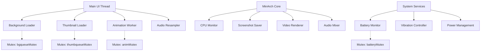
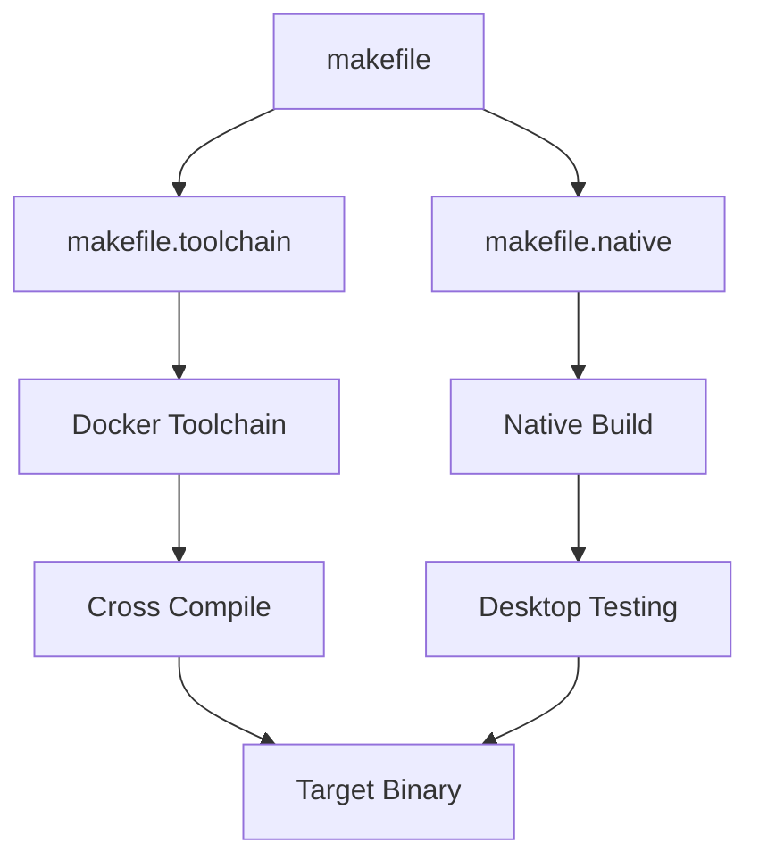
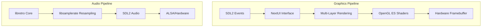

# 📋 Análise Técnica Completa - NextUI Project

> **Custom Firmware de alta performance para dispositivos de gaming retrô portátil**  
> *Documentação técnica abrangente para desenvolvimento e contribuição*

## 📑 Índice

1. [🎯 Visão Executiva](#-visão-executiva)
2. [🏗️ Arquitetura do Sistema](#️-arquitetura-do-sistema)
3. [🔧 Stack Tecnológico Detalhado](#-stack-tecnológico-detalhado)
4. [🌐 Plataformas Suportadas](#-plataformas-suportadas)
5. [🎮 Sistema PAK (Plugin Architecture)](#-sistema-pak-plugin-architecture)
6. [🗄️ Sistema de Persistência e Databases](#️-sistema-de-persistência-e-databases)
7. [🧵 Threading Architecture Detalhada](#-threading-architecture-detalhada)
8. [🛠️ Práticas de Desenvolvimento e DevOps](#️-práticas-de-desenvolvimento-e-devops)
9. [🎯 Conclusões e Recomendações](#-conclusões-e-recomendações)
10. [📚 Referências Técnicas](#-referências-técnicas)

---

## 🎯 Visão Executiva

**NextUI** é um Custom Firmware (CFW) de alta performance baseado em MinUI, com motor de emulação completamente reconstruído para dispositivos portáteis de gaming retrô. Foca principalmente na família **TrimUI** (Brick/Smart Pro) oferecendo experiência de usuário moderna com otimizações de baixo nível.

### ⚡ Características Principais
- **Motor Reconstruído**: Emulação 100% reescrita com threading avançado e latência ~20ms
- **Performance Superior**: CPU scaling dinâmico, audio resampling, renderização multi-threaded
- **Interface Moderna**: Game switcher, animações fluidas, shaders GL ES, multi-layer rendering
- **Ecosystem Extensível**: Sistema PAK modular para emuladores da comunidade (3 tipos distintos)
- **Hardware Integration**: WiFi nativo, LED control RGB/PWM, power management, input daemon
- **Sistema Robusto**: Database SQLite para tracking, threading pool, memory management

### 📊 Métricas do Projeto
```
📝 Linguagens:          C (90%), C++ (8%), Shell (2%)
📈 Linhas de Código:    ~50,000+ (15+ módulos principais)
🎮 Plataformas:         2 ativas (tg5040, desktop) + 8 legacy maintained
🧵 Threading:           6+ worker threads (UI, audio, background, animation)
🎨 Shaders:             3 pass pipeline, OpenGL ES 2.0/3.0
🔧 Build Targets:       Docker toolchain + native development
```

### 🏆 **Diferenciais vs MinUI Original**

| Aspecto | MinUI Original | NextUI |
|---------|---------------|---------|
| **Motor Emulação** | Wrapper básico libretro | ✅ Engine reconstruído com threading |
| **Performance** | Single-thread, latência alta | ✅ Multi-thread, latência ~20ms |
| **Audio** | Resampling básico | ✅ libsamplerate + buffer dinâmico |
| **Graphics** | SDL básico | ✅ OpenGL ES + shaders + multi-layer |
| **Interface** | Lista simples | ✅ Game switcher + animações + temas |
| **Hardware** | Suporte mínimo | ✅ WiFi + LEDs + vibration + power mgmt |
| **Extensibilidade** | Limitada | ✅ Sistema PAK com 3 níveis integração |
| **Database** | Arquivos texto | ✅ SQLite para tracking + histórico |

---

## 🏗️ Arquitetura do Sistema

### 📁 Hierarquia de Diretórios

```
NextUI/ (Root Project)
├── 📦 skeleton/                    # Sistema de Arquivos Base
│   ├── BASE/                      # ✅ Conteúdo universal (ROMs, Saves, Bios)
│   ├── BOOT/                      # 🚀 Scripts de inicialização por plataforma
│   ├── EXTRAS/                    # 🎮 Emuladores e ferramentas opcionais
│   └── SYSTEM/                    # ⚙️ Binários e configurações por dispositivo
├── 🔧 workspace/                   # Código Fonte e Builds
│   ├── all/                       # 🌐 Componentes cross-platform
│   │   ├── nextui/               # 🖥️ Interface principal (2800+ LOC)
│   │   ├── minarch/              # 🎯 Motor emulação (7100+ LOC)
│   │   ├── settings/             # ⚙️ Sistema configuração (C++)
│   │   ├── common/               # 📚 Biblioteca compartilhada
│   │   ├── cores/                # 🎮 Build system para cores libretro
│   │   └── [utilitários...]      # 🔋 battery, clock, gametime, etc
│   ├── desktop/                   # 💻 Build nativo para desenvolvimento
│   │   ├── libmsettings/         # ⚙️ Config system para desktop
│   │   └── platform/             # 🖥️ Abstração desktop (SDL2)
│   └── tg5040/                    # 📱 TrimUI Smart Pro/Brick específico
│       ├── libmsettings/         # ⚙️ Hardware settings (brightness, etc)
│       ├── platform/             # 🔧 Hardware abstraction layer
│       ├── wifimanager/          # 📶 WiFi stack integration
│       └── keymon/               # ⌨️ Input monitoring daemon
├── 🐳 toolchains/                  # Cross-Compilation Toolchains
│   └── {platform}-toolchain/     # 🛠️ Docker-based build environments
├── 📋 makefile                     # 🎯 Build orchestration principal
├── 🐳 docker-compose.yml           # 🔄 Desenvolvimento containerizado
└── 📄 *.md                        # 📖 Documentação e especificações
```

### 🧩 Componentes do Sistema

#### 🎮 **Core Components**

| Componente | Localização | Responsabilidade | Tecnologia | LOC | Status |
|------------|-------------|------------------|------------|-----|--------|
| **NextUI** | `all/nextui/` | Interface principal, navegação | C + SDL2 + OpenGL | ~2800 | ✅ Ativo |
| **MinArch** | `all/minarch/` | Motor emulação, libretro wrapper | C + Threading + Shaders | ~7100 | ✅ Ativo |
| **Settings** | `all/settings/` | Sistema configuração visual | C++ + UI Components | ~800 | ✅ Ativo |
| **Common API** | `all/common/` | Biblioteca base, abstrações | C + Headers + Threading | ~3200 | ✅ Core |
| **Platform Layer** | `{platform}/platform/` | Hardware abstraction | C + Linux APIs + GPIO | ~3400 | ✅ HAL |

#### 🛠️ **System Utilities & Libraries**

| Utilitário | Função | Integração | Threading | Database |
|------------|--------|-------------|-----------|----------|
| **GameTime DB** | Rastreamento tempo jogo + estatísticas | SQLite + libgametimedb | Background worker | ✅ SQLite |
| **Battery Monitor** | Monitoramento bateria + gráficos histórico | `sysfs` + libbatmondb | Dedicated thread | ✅ SQLite |
| **Clock System** | Relógio sistema + timezone sync | RTC + NTP client | Event-driven | ❌ Config |
| **LED Controller** | Controle RGB LEDs + efeitos ambientais | GPIO + PWM + brightness | Hardware IRQ | ❌ Direct |
| **WiFi Manager** | Gerenciamento conexões + auto-connect | `wpa_supplicant` + networking | Process monitor | ❌ Config |
| **Key Monitor** | Input daemon + hotkeys globais | Linux input subsystem | Event loop | ❌ Direct |
| **Vibration Engine** | Haptic feedback + patterns | PWM + timing control | Thread pool | ❌ Direct |

#### 📊 **Threading Architecture Overview**



#### 🎯 **Build System**



---

## 🔧 Stack Tecnológico Detalhado

### 🎨 **Graphics & Multimedia Stack**



#### **🖼️ SDL2 (Simple DirectMedia Layer)**
```c
// Configuração multi-platform
#if defined(USE_SDL2)
    #include <SDL2/SDL.h>
    #include <SDL2/SDL_opengl.h>
    #include <SDL2/SDL_image.h>     // PNG, JPG, BMP, GIF
    #include <SDL2/SDL_ttf.h>       // TrueType, OpenType, CJK fonts
    #define WHICH_SDL "SDL2"
#else
    #include <SDL/SDL.h>            // Fallback para SDL 1.2
    #define WHICH_SDL "SDL"
#endif
```

**Módulos Utilizados:**
- 🎮 **SDL_events**: Input handling (joystick, keyboard, GPIO)
- 🖼️ **SDL_surface**: Software rendering e blitting
- 🎯 **SDL_texture**: Hardware-accelerated textures
- 🎵 **SDL_audio**: Audio output com callback threading
- 🖥️ **SDL_video**: Janelas e contextos OpenGL

#### **🎮 OpenGL ES / OpenGL**
```c
// Sistema de shaders configurável
typedef struct Shader {
    int srcw, srch, texw, texh;    // Dimensões source/texture
    int filter;                     // GL_LINEAR / GL_NEAREST
    GLuint shader_p;               // Program handle
    int scale;                     // Fator escala (1x, 2x, 3x)
    GLuint texture;                // Texture buffer
    int updated;                   // Dirty flag
    GLint u_FrameDirection;        // Uniform: frame direction
    GLint u_FrameCount;            // Uniform: frame counter
    GLint u_OutputSize;            // Uniform: output resolution
    GLint u_TextureSize;           // Uniform: texture size
    GLint u_InputSize;             // Uniform: input resolution
    ShaderParam *pragmas;          // Dynamic shader parameters
    int num_pragmas;               // Parameter count
} Shader;

// Multi-pass pipeline (até 3 passes)
Shader* shaders[MAXSHADERS] = {
    &(Shader){ .scale = 1, .filter = GL_LINEAR, .filename ="stock.glsl" },
    &(Shader){ .scale = 2, .filter = GL_NEAREST, .filename ="crt.glsl" },
    &(Shader){ .scale = 1, .filter = GL_LINEAR, .filename ="final.glsl" }
};
```

**Características:**
- 🎯 **Multi-pass rendering**: Até 3 stages de processamento
- 🖼️ **5-layer compositing**: Background, UI, thumbnails, text, overlays
- ⚡ **Hardware acceleration**: GPU-based scaling e filtering
- 🎨 **Dynamic shaders**: GLSL loading em runtime
- 📐 **Multiple scaling modes**: Fullscreen, aspect, fill

#### **🎵 libsamplerate (Secret Rabbit Code)**
```c
#include <samplerate.h>

// Algoritmos de resampling disponíveis
typedef enum {
    SRC_SINC_BEST_QUALITY    = 0,  // Mais lento, melhor qualidade
    SRC_SINC_MEDIUM_QUALITY  = 1,  // Balanced quality/performance  
    SRC_SINC_FASTEST         = 2,  // Mais rápido, qualidade ok
    SRC_ZERO_ORDER_HOLD      = 3,  // Sem interpolação
    SRC_LINEAR               = 4   // Interpolação linear
} converter_type;

// Configuração dinâmica por core
int audio_quality = CFG_getAudioQuality(core_name);
SRC_STATE* converter = src_new(audio_quality, channels, &error);

// Resampling em tempo real
int frames_generated = src_process(converter, &src_data);
```

**Especificações:**
- 🎼 **Entrada**: 8kHz - 192kHz sample rates
- 🎵 **Saída**: Hardware native rate (tipicamente 48kHz)
- ⚡ **Latência**: <20ms com buffers otimizados
- 🎯 **Qualidade**: Configurável por emulador (performance vs quality)
- 🔄 **Threading**: Audio thread isolado para zero drops

### 🧵 **Threading & Concurrency**

```c
// Threading model principal
static pthread_t core_pt;                    // Core emulation thread
static pthread_mutex_t core_mx;              // Core state protection
static pthread_cond_t core_rq;               // Core sync condition

// Worker threads especializados
SDL_CreateThread(BGLoadWorker, "BGLoadWorker", NULL);      // Background loading
SDL_CreateThread(ThumbLoadWorker, "ThumbLoadWorker", NULL); // Thumbnail loading  
SDL_CreateThread(animWorker, "animWorker", NULL);          // Animation processing
SDL_CreateThread(PLAT_cpu_monitor, "CPUMonitor", NULL);    // System monitoring
```

#### **🔄 Producer-Consumer Patterns**
```c
// Queue thread-safe para tasks
typedef struct TaskNode {
    LoadBackgroundTask* task;
    struct TaskNode* next;
} TaskNode;

static TaskNode* taskBGQueueHead = NULL;
static SDL_mutex* bgqueueMutex = NULL;
static SDL_cond* bgqueueCond = NULL;

// Worker pattern
int BGLoadWorker(void* data) {
    while (running) {
        SDL_LockMutex(bgqueueMutex);
        while (!taskBGQueueHead) {
            SDL_CondWait(bgqueueCond, bgqueueMutex);  // Block até task
        }
        
        TaskNode* node = taskBGQueueHead;             // Dequeue
        taskBGQueueHead = node->next;
        SDL_UnlockMutex(bgqueueMutex);
        
        processBackgroundTask(node->task);           // Process
        free(node);
    }
    return 0;
}
```

#### **🚀 Performance Threading**
- **🎮 Core Thread**: Emulação isolada do UI thread
- **🖼️ Background Loader**: Carregamento assíncrono de imagens
- **🔳 Thumbnail Worker**: Processamento de game art
- **🎬 Animation Thread**: Interpolação e efeitos
- **🔋 System Monitor**: CPU/temp/battery tracking
- **📡 Network Stack**: WiFi e sync automático

### 🗃️ **Data Management**

#### **⚙️ libmsettings - Configuration Engine**
```c
// Sistema key-value persistente
typedef struct {
    char key[64];         // Setting identifier
    char value[256];      // String value
} SettingEntry;

// API unificada
int GetInt(const char* key, int default_value);
void SetInt(const char* key, int value);
char* GetString(const char* key, char* buffer, int size, const char* default_value);
void SetString(const char* key, const char* value);

// Hardware settings (tg5040)
int GetBrightness(void);      // 0-10 scale
void SetBrightness(int value);
int GetColortemp(void);       // 0-40 scale (blue-red)
void SetVolume(int value);    // 0-20 scale
```

**Características:**
- 💾 **Persistent storage**: Auto-save para storage
- 🔧 **Hardware integration**: Brightness, volume, temperature
- 🎮 **Per-core configs**: Settings específicos por emulador
- 🔄 **Change callbacks**: Notificação em tempo real
- 🛡️ **Thread-safe**: Concurrent access protection

#### **📊 Hash Tables & Collections**
```c
// Hash table genérica para cache
typedef struct Hash Hash;
Hash* Hash_new(void);
void Hash_set(Hash* self, char* key, void* value);
void* Hash_get(Hash* self, char* key);

// Dynamic arrays redimensionáveis
typedef struct Array {
    void** items;      // Pointer array
    int count;         // Current count
    int capacity;      // Allocated capacity
} Array;

// Usage examples
Hash* rom_aliases = Hash_new();           // ROM name mapping
Array* recent_games = Array_new();        // Recent games list
Array* directory_stack = Array_new();     // Navigation breadcrumbs
```

### 🌐 **Network & Connectivity**

#### **📶 WiFi Stack Integration**
```c
// wpa_supplicant wrapper
static int connectWiFi(const char* ssid, const char* password) {
    char cmd[512];
    
    // Generate WPA config
    snprintf(cmd, sizeof(cmd), 
        "wpa_passphrase '%s' '%s' > /tmp/wpa.conf", ssid, password);
    system(cmd);
    
    // Connect and get DHCP
    system("wpa_supplicant -B -i wlan0 -c /tmp/wpa.conf");
    system("dhclient wlan0");
    
    return PLAT_isOnline();  // Ping test
}

// Auto-connect on boot
static void autoConnectWiFi(void) {
    char ssid[64], password[64];
    if (GetString("wifi_ssid", ssid, sizeof(ssid), "") && 
        GetString("wifi_password", password, sizeof(password), "")) {
        connectWiFi(ssid, password);
    }
}
```

#### **🕒 NTP Time Synchronization**
```c
static void syncNetworkTime(void) {
    if (!PLAT_isOnline()) return;
    
    char timezone[64];
    GetString("timezone", timezone, sizeof(timezone), "UTC");
    
    // Sync with NTP servers
    char cmd[256];
    snprintf(cmd, sizeof(cmd), 
        "ntpdate pool.ntp.org && timedatectl set-timezone %s", timezone);
    system(cmd);
    
    // Save to hardware RTC
    system("hwclock --systohc");
    
    LOG_info("Time synced: %s\n", timezone);
}
```

### 🔌 **libretro Core Integration**

#### **📦 Dynamic Core Loading**
```c
// Core loading system
static void* core_handle = NULL;
static retro_environment_t retro_environment_cb;
static retro_video_refresh_t retro_video_refresh_cb;
static retro_audio_sample_t retro_audio_sample_cb;
static retro_input_poll_t retro_input_poll_cb;

static int loadCore(const char* core_path) {
    core_handle = dlopen(core_path, RTLD_LAZY);
    if (!core_handle) {
        LOG_error("Failed to load core: %s\n", dlerror());
        return -1;
    }
    
    // Bind required functions
    retro_init = dlsym(core_handle, "retro_init");
    retro_deinit = dlsym(core_handle, "retro_deinit");
    retro_api_version = dlsym(core_handle, "retro_api_version");
    retro_get_system_info = dlsym(core_handle, "retro_get_system_info");
    retro_get_system_av_info = dlsym(core_handle, "retro_get_system_av_info");
    retro_set_environment = dlsym(core_handle, "retro_set_environment");
    retro_set_video_refresh = dlsym(core_handle, "retro_set_video_refresh");
    retro_set_audio_sample = dlsym(core_handle, "retro_set_audio_sample");
    retro_set_input_poll = dlsym(core_handle, "retro_set_input_poll");
    retro_set_input_state = dlsym(core_handle, "retro_set_input_state");
    retro_run = dlsym(core_handle, "retro_run");
    retro_load_game = dlsym(core_handle, "retro_load_game");
    retro_unload_game = dlsym(core_handle, "retro_unload_game");
    
    return 0;
}
```

#### **🎮 Core Build System**
```makefile
# Template para build de cores
define TEMPLATE=
$1_REPO ?= https://github.com/libretro/$(1)
$1_MAKE ?= make platform=$(PLATFORM) $($(1)_FLAGS)

src/$(1):
	git clone $(if $($1_HASH),,--depth 1) $$($(1)_REPO) src/$(1)
	$(if $($1_HASH),cd src/$(1) && git checkout $($1_HASH))
	$(if $($1_SUBMODULES),cd src/$(1) && git submodule update --init)

output/$(1)_libretro.so: src/$(1)/.patched
	cd src/$(1) && $$($1_MAKE) -j4
	cp src/$(1)/$(1)_libretro.so output/
endef

# Cores suportados  
$(eval $(call TEMPLATE,fceumm))      # Nintendo/Famicom
$(eval $(call TEMPLATE,gambatte))    # Game Boy/Color
$(eval $(call TEMPLATE,mgba))        # Game Boy Advance
$(eval $(call TEMPLATE,picodrive))   # Sega Genesis/CD/32X
$(eval $(call TEMPLATE,pcsx_rearmed)) # PlayStation
```

---

## 🔧 Stack Tecnológico Detalhado

### 🎨 **Graphics & Multimedia Stack**


#### **🖼️ SDL2 (Simple DirectMedia Layer)**
```c
// Configuração multi-platform
#if defined(USE_SDL2)
    #include <SDL2/SDL.h>
    #include <SDL2/SDL_opengl.h>
    #include <SDL2/SDL_image.h>     // PNG, JPG, BMP, GIF
    #include <SDL2/SDL_ttf.h>       // TrueType, OpenType, CJK fonts
    #define WHICH_SDL "SDL2"
#else
    #include <SDL/SDL.h>            // Fallback para SDL 1.2
    #define WHICH_SDL "SDL"
#endif
```

**Módulos Utilizados:**
- 🎮 **SDL_events**: Input handling (joystick, keyboard, GPIO)
- 🖼️ **SDL_surface**: Software rendering e blitting
- 🎯 **SDL_texture**: Hardware-accelerated textures
- 🎵 **SDL_audio**: Audio output com callback threading
- 🖥️ **SDL_video**: Janelas e contextos OpenGL

#### **🎮 OpenGL ES / OpenGL**
```c
// Sistema de shaders configurável
typedef struct Shader {
    int srcw, srch, texw, texh;    // Dimensões source/texture
    int filter;                     // GL_LINEAR / GL_NEAREST
    GLuint shader_p;               // Program handle
    int scale;                     // Fator escala (1x, 2x, 3x)
    GLuint texture;                // Texture buffer
    int updated;                   // Dirty flag
    GLint u_FrameDirection;        // Uniform: frame direction
    GLint u_FrameCount;            // Uniform: frame counter
    GLint u_OutputSize;            // Uniform: output resolution
    GLint u_TextureSize;           // Uniform: texture size
    GLint u_InputSize;             // Uniform: input resolution
    ShaderParam *pragmas;          // Dynamic shader parameters
    int num_pragmas;               // Parameter count
} Shader;

// Multi-pass pipeline (até 3 passes)
Shader* shaders[MAXSHADERS] = {
    &(Shader){ .scale = 1, .filter = GL_LINEAR, .filename ="stock.glsl" },
    &(Shader){ .scale = 2, .filter = GL_NEAREST, .filename ="crt.glsl" },
    &(Shader){ .scale = 1, .filter = GL_LINEAR, .filename ="final.glsl" }
};
```

**Características:**
- 🎯 **Multi-pass rendering**: Até 3 stages de processamento
- 🖼️ **5-layer compositing**: Background, UI, thumbnails, text, overlays
- ⚡ **Hardware acceleration**: GPU-based scaling e filtering
- 🎨 **Dynamic shaders**: GLSL loading em runtime
- 📐 **Multiple scaling modes**: Fullscreen, aspect, fill

#### **🎵 libsamplerate (Secret Rabbit Code)**
```c
#include <samplerate.h>

// Algoritmos de resampling disponíveis
typedef enum {
    SRC_SINC_BEST_QUALITY    = 0,  // Mais lento, melhor qualidade
    SRC_SINC_MEDIUM_QUALITY  = 1,  // Balanced quality/performance  
    SRC_SINC_FASTEST         = 2,  // Mais rápido, qualidade ok
    SRC_ZERO_ORDER_HOLD      = 3,  // Sem interpolação
    SRC_LINEAR               = 4   // Interpolação linear
} converter_type;

// Configuração dinâmica por core
int audio_quality = CFG_getAudioQuality(core_name);
SRC_STATE* converter = src_new(audio_quality, channels, &error);

// Resampling em tempo real
int frames_generated = src_process(converter, &src_data);
```

**Especificações:**
- 🎼 **Entrada**: 8kHz - 192kHz sample rates
- 🎵 **Saída**: Hardware native rate (tipicamente 48kHz)
- ⚡ **Latência**: <20ms com buffers otimizados
- 🎯 **Qualidade**: Configurável por emulador (performance vs quality)
- 🔄 **Threading**: Audio thread isolado para zero drops

### 🧵 **Threading & Concurrency**

```c
// Threading model principal
static pthread_t core_pt;                    // Core emulation thread
static pthread_mutex_t core_mx;              // Core state protection
static pthread_cond_t core_rq;               // Core sync condition

// Worker threads especializados
SDL_CreateThread(BGLoadWorker, "BGLoadWorker", NULL);      // Background loading
SDL_CreateThread(ThumbLoadWorker, "ThumbLoadWorker", NULL); // Thumbnail loading  
SDL_CreateThread(animWorker, "animWorker", NULL);          // Animation processing
SDL_CreateThread(PLAT_cpu_monitor, "CPUMonitor", NULL);    // System monitoring
```

#### **🔄 Producer-Consumer Patterns**
```c
// Queue thread-safe para tasks
typedef struct TaskNode {
    LoadBackgroundTask* task;
    struct TaskNode* next;
} TaskNode;

static TaskNode* taskBGQueueHead = NULL;
static SDL_mutex* bgqueueMutex = NULL;
static SDL_cond* bgqueueCond = NULL;

// Worker pattern
int BGLoadWorker(void* data) {
    while (running) {
        SDL_LockMutex(bgqueueMutex);
        while (!taskBGQueueHead) {
            SDL_CondWait(bgqueueCond, bgqueueMutex);  // Block até task
        }
        
        TaskNode* node = taskBGQueueHead;             // Dequeue
        taskBGQueueHead = node->next;
        SDL_UnlockMutex(bgqueueMutex);
        
        processBackgroundTask(node->task);           // Process
        free(node);
    }
    return 0;
}
```

#### **🚀 Performance Threading**
- **🎮 Core Thread**: Emulação isolada do UI thread
- **🖼️ Background Loader**: Carregamento assíncrono de imagens
- **🔳 Thumbnail Worker**: Processamento de game art
- **🎬 Animation Thread**: Interpolação e efeitos
- **🔋 System Monitor**: CPU/temp/battery tracking
- **📡 Network Stack**: WiFi e sync automático

### 🗃️ **Data Management**

#### **⚙️ libmsettings - Configuration Engine**
```c
// Sistema key-value persistente
typedef struct {
    char key[64];         // Setting identifier
    char value[256];      // String value
} SettingEntry;

// API unificada
int GetInt(const char* key, int default_value);
void SetInt(const char* key, int value);
char* GetString(const char* key, char* buffer, int size, const char* default_value);
void SetString(const char* key, const char* value);

// Hardware settings (tg5040)
int GetBrightness(void);      // 0-10 scale
void SetBrightness(int value);
int GetColortemp(void);       // 0-40 scale (blue-red)
void SetVolume(int value);    // 0-20 scale
```

**Características:**
- 💾 **Persistent storage**: Auto-save para storage
- 🔧 **Hardware integration**: Brightness, volume, temperature
- 🎮 **Per-core configs**: Settings específicos por emulador
- 🔄 **Change callbacks**: Notificação em tempo real
- 🛡️ **Thread-safe**: Concurrent access protection

#### **📊 Hash Tables & Collections**
```c
// Hash table genérica para cache
typedef struct Hash Hash;
Hash* Hash_new(void);
void Hash_set(Hash* self, char* key, void* value);
void* Hash_get(Hash* self, char* key);

// Dynamic arrays redimensionáveis
typedef struct Array {
    void** items;      // Pointer array
    int count;         // Current count
    int capacity;      // Allocated capacity
} Array;

// Usage examples
Hash* rom_aliases = Hash_new();           // ROM name mapping
Array* recent_games = Array_new();        // Recent games list
Array* directory_stack = Array_new();     // Navigation breadcrumbs
```

### 🌐 **Network & Connectivity**

#### **📶 WiFi Stack Integration**
```c
// wpa_supplicant wrapper
static int connectWiFi(const char* ssid, const char* password) {
    char cmd[512];
    
    // Generate WPA config
    snprintf(cmd, sizeof(cmd), 
        "wpa_passphrase '%s' '%s' > /tmp/wpa.conf", ssid, password);
    system(cmd);
    
    // Connect and get DHCP
    system("wpa_supplicant -B -i wlan0 -c /tmp/wpa.conf");
    system("dhclient wlan0");
    
    return PLAT_isOnline();  // Ping test
}

// Auto-connect on boot
static void autoConnectWiFi(void) {
    char ssid[64], password[64];
    if (GetString("wifi_ssid", ssid, sizeof(ssid), "") && 
        GetString("wifi_password", password, sizeof(password), "")) {
        connectWiFi(ssid, password);
    }
}
```

#### **🕒 NTP Time Synchronization**
```c
static void syncNetworkTime(void) {
    if (!PLAT_isOnline()) return;
    
    char timezone[64];
    GetString("timezone", timezone, sizeof(timezone), "UTC");
    
    // Sync with NTP servers
    char cmd[256];
    snprintf(cmd, sizeof(cmd), 
        "ntpdate pool.ntp.org && timedatectl set-timezone %s", timezone);
    system(cmd);
    
    // Save to hardware RTC
    system("hwclock --systohc");
    
    LOG_info("Time synced: %s\n", timezone);
}
```

### 🔌 **libretro Core Integration**

#### **📦 Dynamic Core Loading**
```c
// Core loading system
static void* core_handle = NULL;
static retro_environment_t retro_environment_cb;
static retro_video_refresh_t retro_video_refresh_cb;
static retro_audio_sample_t retro_audio_sample_cb;
static retro_input_poll_t retro_input_poll_cb;

static int loadCore(const char* core_path) {
    core_handle = dlopen(core_path, RTLD_LAZY);
    if (!core_handle) {
        LOG_error("Failed to load core: %s\n", dlerror());
        return -1;
    }
    
    // Bind required functions
    retro_init = dlsym(core_handle, "retro_init");
    retro_deinit = dlsym(core_handle, "retro_deinit");
    retro_api_version = dlsym(core_handle, "retro_api_version");
    retro_get_system_info = dlsym(core_handle, "retro_get_system_info");
    retro_get_system_av_info = dlsym(core_handle, "retro_get_system_av_info");
    retro_set_environment = dlsym(core_handle, "retro_set_environment");
    retro_set_video_refresh = dlsym(core_handle, "retro_set_video_refresh");
    retro_set_audio_sample = dlsym(core_handle, "retro_set_audio_sample");
    retro_set_input_poll = dlsym(core_handle, "retro_set_input_poll");
    retro_set_input_state = dlsym(core_handle, "retro_set_input_state");
    retro_run = dlsym(core_handle, "retro_run");
    retro_load_game = dlsym(core_handle, "retro_load_game");
    retro_unload_game = dlsym(core_handle, "retro_unload_game");
    
    return 0;
}
```

#### **🎮 Core Build System**
```makefile
# Template para build de cores
define TEMPLATE=
$1_REPO ?= https://github.com/libretro/$(1)
$1_MAKE ?= make platform=$(PLATFORM) $($(1)_FLAGS)

src/$(1):
	git clone $(if $($1_HASH),,--depth 1) $$($(1)_REPO) src/$(1)
	$(if $($1_HASH),cd src/$(1) && git checkout $($1_HASH))
	$(if $($1_SUBMODULES),cd src/$(1) && git submodule update --init)

output/$(1)_libretro.so: src/$(1)/.patched
	cd src/$(1) && $$($1_MAKE) -j4
	cp src/$(1)/$(1)_libretro.so output/
endef

# Cores suportados  
$(eval $(call TEMPLATE,fceumm))      # Nintendo/Famicom
$(eval $(call TEMPLATE,gambatte))    # Game Boy/Color
$(eval $(call TEMPLATE,mgba))        # Game Boy Advance
$(eval $(call TEMPLATE,picodrive))   # Sega Genesis/CD/32X
$(eval $(call TEMPLATE,pcsx_rearmed)) # PlayStation
```

---

## 🔧 Stack Tecnológico Detalhado

### 🎨 **Graphics & Multimedia Stack**


#### **🖼️ SDL2 (Simple DirectMedia Layer)**
```c
// Configuração multi-platform
#if defined(USE_SDL2)
    #include <SDL2/SDL.h>
    #include <SDL2/SDL_opengl.h>
    #include <SDL2/SDL_image.h>     // PNG, JPG, BMP, GIF
    #include <SDL2/SDL_ttf.h>       // TrueType, OpenType, CJK fonts
    #define WHICH_SDL "SDL2"
#else
    #include <SDL/SDL.h>            // Fallback para SDL 1.2
    #define WHICH_SDL "SDL"
#endif
```

**Módulos Utilizados:**
- 🎮 **SDL_events**: Input handling (joystick, keyboard, GPIO)
- 🖼️ **SDL_surface**: Software rendering e blitting
- 🎯 **SDL_texture**: Hardware-accelerated textures
- 🎵 **SDL_audio**: Audio output com callback threading
- 🖥️ **SDL_video**: Janelas e contextos OpenGL

#### **🎮 OpenGL ES / OpenGL**
```c
// Sistema de shaders configurável
typedef struct Shader {
    int srcw, srch, texw, texh;    // Dimensões source/texture
    int filter;                     // GL_LINEAR / GL_NEAREST
    GLuint shader_p;               // Program handle
    int scale;                     // Fator escala (1x, 2x, 3x)
    GLuint texture;                // Texture buffer
    int updated;                   // Dirty flag
    GLint u_FrameDirection;        // Uniform: frame direction
    GLint u_FrameCount;            // Uniform: frame counter
    GLint u_OutputSize;            // Uniform: output resolution
    GLint u_TextureSize;           // Uniform: texture size
    GLint u_InputSize;             // Uniform: input resolution
    ShaderParam *pragmas;          // Dynamic shader parameters
    int num_pragmas;               // Parameter count
} Shader;

// Multi-pass pipeline (até 3 passes)
Shader* shaders[MAXSHADERS] = {
    &(Shader){ .scale = 1, .filter = GL_LINEAR, .filename ="stock.glsl" },
    &(Shader){ .scale = 2, .filter = GL_NEAREST, .filename ="crt.glsl" },
    &(Shader){ .scale = 1, .filter = GL_LINEAR, .filename ="final.glsl" }
};
```

**Características:**
- 🎯 **Multi-pass rendering**: Até 3 stages de processamento
- 🖼️ **5-layer compositing**: Background, UI, thumbnails, text, overlays
- ⚡ **Hardware acceleration**: GPU-based scaling e filtering
- 🎨 **Dynamic shaders**: GLSL loading em runtime
- 📐 **Multiple scaling modes**: Fullscreen, aspect, fill

#### **🎵 libsamplerate (Secret Rabbit Code)**
```c
#include <samplerate.h>

// Algoritmos de resampling disponíveis
typedef enum {
    SRC_SINC_BEST_QUALITY    = 0,  // Mais lento, melhor qualidade
    SRC_SINC_MEDIUM_QUALITY  = 1,  // Balanced quality/performance  
    SRC_SINC_FASTEST         = 2,  // Mais rápido, qualidade ok
    SRC_ZERO_ORDER_HOLD      = 3,  // Sem interpolação
    SRC_LINEAR               = 4   // Interpolação linear
} converter_type;

// Configuração dinâmica por core
int audio_quality = CFG_getAudioQuality(core_name);
SRC_STATE* converter = src_new(audio_quality, channels, &error);

// Resampling em tempo real
int frames_generated = src_process(converter, &src_data);
```

**Especificações:**
- 🎼 **Entrada**: 8kHz - 192kHz sample rates
- 🎵 **Saída**: Hardware native rate (tipicamente 48kHz)
- ⚡ **Latência**: <20ms com buffers otimizados
- 🎯 **Qualidade**: Configurável por emulador (performance vs quality)
- 🔄 **Threading**: Audio thread isolado para zero drops

### 🧵 **Threading & Concurrency**

```c
// Threading model principal
static pthread_t core_pt;                    // Core emulation thread
static pthread_mutex_t core_mx;              // Core state protection
static pthread_cond_t core_rq;               // Core sync condition

// Worker threads especializados
SDL_CreateThread(BGLoadWorker, "BGLoadWorker", NULL);      // Background loading
SDL_CreateThread(ThumbLoadWorker, "ThumbLoadWorker", NULL); // Thumbnail loading  
SDL_CreateThread(animWorker, "animWorker", NULL);          // Animation processing
SDL_CreateThread(PLAT_cpu_monitor, "CPUMonitor", NULL);    // System monitoring
```

#### **🔄 Producer-Consumer Patterns**
```c
// Queue thread-safe para tasks
typedef struct TaskNode {
    LoadBackgroundTask* task;
    struct TaskNode* next;
} TaskNode;

static TaskNode* taskBGQueueHead = NULL;
static SDL_mutex* bgqueueMutex = NULL;
static SDL_cond* bgqueueCond = NULL;

// Worker pattern
int BGLoadWorker(void* data) {
    while (running) {
        SDL_LockMutex(bgqueueMutex);
        while (!taskBGQueueHead) {
            SDL_CondWait(bgqueueCond, bgqueueMutex);  // Block até task
        }
        
        TaskNode* node = taskBGQueueHead;             // Dequeue
        taskBGQueueHead = node->next;
        SDL_UnlockMutex(bgqueueMutex);
        
        processBackgroundTask(node->task);           // Process
        free(node);
    }
    return 0;
}
```

#### **🚀 Performance Threading**
- **🎮 Core Thread**: Emulação isolada do UI thread
- **🖼️ Background Loader**: Carregamento assíncrono de imagens
- **🔳 Thumbnail Worker**: Processamento de game art
- **🎬 Animation Thread**: Interpolação e efeitos
- **🔋 System Monitor**: CPU/temp/battery tracking
- **📡 Network Stack**: WiFi e sync automático

### 🗃️ **Data Management**

#### **⚙️ libmsettings - Configuration Engine**
```c
// Sistema key-value persistente
typedef struct {
    char key[64];         // Setting identifier
    char value[256];      // String value
} SettingEntry;

// API unificada
int GetInt(const char* key, int default_value);
void SetInt(const char* key, int value);
char* GetString(const char* key, char* buffer, int size, const char* default_value);
void SetString(const char* key, const char* value);

// Hardware settings (tg5040)
int GetBrightness(void);      // 0-10 scale
void SetBrightness(int value);
int GetColortemp(void);       // 0-40 scale (blue-red)
void SetVolume(int value);    // 0-20 scale
```

**Características:**
- 💾 **Persistent storage**: Auto-save para storage
- 🔧 **Hardware integration**: Brightness, volume, temperature
- 🎮 **Per-core configs**: Settings específicos por emulador
- 🔄 **Change callbacks**: Notificação em tempo real
- 🛡️ **Thread-safe**: Concurrent access protection

#### **📊 Hash Tables & Collections**
```c
// Hash table genérica para cache
typedef struct Hash Hash;
Hash* Hash_new(void);
void Hash_set(Hash* self, char* key, void* value);
void* Hash_get(Hash* self, char* key);

// Dynamic arrays redimensionáveis
typedef struct Array {
    void** items;      // Pointer array
    int count;         // Current count
    int capacity;      // Allocated capacity
} Array;

// Usage examples
Hash* rom_aliases = Hash_new();           // ROM name mapping
Array* recent_games = Array_new();        // Recent games list
Array* directory_stack = Array_new();     // Navigation breadcrumbs
```

### 🌐 **Network & Connectivity**

#### **📶 WiFi Stack Integration**
```c
// wpa_supplicant wrapper
static int connectWiFi(const char* ssid, const char* password) {
    char cmd[512];
    
    // Generate WPA config
    snprintf(cmd, sizeof(cmd), 
        "wpa_passphrase '%s' '%s' > /tmp/wpa.conf", ssid, password);
    system(cmd);
    
    // Connect and get DHCP
    system("wpa_supplicant -B -i wlan0 -c /tmp/wpa.conf");
    system("dhclient wlan0");
    
    return PLAT_isOnline();  // Ping test
}

// Auto-connect on boot
static void autoConnectWiFi(void) {
    char ssid[64], password[64];
    if (GetString("wifi_ssid", ssid, sizeof(ssid), "") && 
        GetString("wifi_password", password, sizeof(password), "")) {
        connectWiFi(ssid, password);
    }
}
```

#### **🕒 NTP Time Synchronization**
```c
static void syncNetworkTime(void) {
    if (!PLAT_isOnline()) return;
    
    char timezone[64];
    GetString("timezone", timezone, sizeof(timezone), "UTC");
    
    // Sync with NTP servers
    char cmd[256];
    snprintf(cmd, sizeof(cmd), 
        "ntpdate pool.ntp.org && timedatectl set-timezone %s", timezone);
    system(cmd);
    
    // Save to hardware RTC
    system("hwclock --systohc");
    
    LOG_info("Time synced: %s\n", timezone);
}
```

### 🔌 **libretro Core Integration**

#### **📦 Dynamic Core Loading**
```c
// Core loading system
static void* core_handle = NULL;
static retro_environment_t retro_environment_cb;
static retro_video_refresh_t retro_video_refresh_cb;
static retro_audio_sample_t retro_audio_sample_cb;
static retro_input_poll_t retro_input_poll_cb;

static int loadCore(const char* core_path) {
    core_handle = dlopen(core_path, RTLD_LAZY);
    if (!core_handle) {
        LOG_error("Failed to load core: %s\n", dlerror());
        return -1;
    }
    
    // Bind required functions
    retro_init = dlsym(core_handle, "retro_init");
    retro_deinit = dlsym(core_handle, "retro_deinit");
    retro_api_version = dlsym(core_handle, "retro_api_version");
    retro_get_system_info = dlsym(core_handle, "retro_get_system_info");
    retro_get_system_av_info = dlsym(core_handle, "retro_get_system_av_info");
    retro_set_environment = dlsym(core_handle, "retro_set_environment");
    retro_set_video_refresh = dlsym(core_handle, "retro_set_video_refresh");
    retro_set_audio_sample = dlsym(core_handle, "retro_set_audio_sample");
    retro_set_input_poll = dlsym(core_handle, "retro_set_input_poll");
    retro_set_input_state = dlsym(core_handle, "retro_set_input_state");
    retro_run = dlsym(core_handle, "retro_run");
    retro_load_game = dlsym(core_handle, "retro_load_game");
    retro_unload_game = dlsym(core_handle, "retro_unload_game");
    
    return 0;
}
```

#### **🎮 Core Build System**
```makefile
# Template para build de cores
define TEMPLATE=
$1_REPO ?= https://github.com/libretro/$(1)
$1_MAKE ?= make platform=$(PLATFORM) $($(1)_FLAGS)

src/$(1):
	git clone $(if $($1_HASH),,--depth 1) $$($(1)_REPO) src/$(1)
	$(if $($1_HASH),cd src/$(1) && git checkout $($1_HASH))
	$(if $($1_SUBMODULES),cd src/$(1) && git submodule update --init)

output/$(1)_libretro.so: src/$(1)/.patched
	cd src/$(1) && $$($1_MAKE) -j4
	cp src/$(1)/$(1)_libretro.so output/
endef

# Cores suportados  
$(eval $(call TEMPLATE,fceumm))      # Nintendo/Famicom
$(eval $(call TEMPLATE,gambatte))    # Game Boy/Color
$(eval $(call TEMPLATE,mgba))        # Game Boy Advance
$(eval $(call TEMPLATE,picodrive))   # Sega Genesis/CD/32X
$(eval $(call TEMPLATE,pcsx_rearmed)) # PlayStation
```

---

## 🔧 Stack Tecnológico Detalhado

### 🎨 **Graphics & Multimedia Stack**


#### **🖼️ SDL2 (Simple DirectMedia Layer)**
```c
// Configuração multi-platform
#if defined(USE_SDL2)
    #include <SDL2/SDL.h>
    #include <SDL2/SDL_opengl.h>
    #include <SDL2/SDL_image.h>     // PNG, JPG, BMP, GIF
    #include <SDL2/SDL_ttf.h>       // TrueType, OpenType, CJK fonts
    #define WHICH_SDL "SDL2"
#else
    #include <SDL/SDL.h>            // Fallback para SDL 1.2
    #define WHICH_SDL "SDL"
#endif
```

**Módulos Utilizados:**
- 🎮 **SDL_events**: Input handling (joystick, keyboard, GPIO)
- 🖼️ **SDL_surface**: Software rendering e blitting
- 🎯 **SDL_texture**: Hardware-accelerated textures
- 🎵 **SDL_audio**: Audio output com callback threading
- 🖥️ **SDL_video**: Janelas e contextos OpenGL

#### **🎮 OpenGL ES / OpenGL**
```c
// Sistema de shaders configurável
typedef struct Shader {
    int srcw, srch, texw, texh;    // Dimensões source/texture
    int filter;                     // GL_LINEAR / GL_NEAREST
    GLuint shader_p;               // Program handle
    int scale;                     // Fator escala (1x, 2x, 3x)
    GLuint texture;                // Texture buffer
    int updated;                   // Dirty flag
    GLint u_FrameDirection;        // Uniform: frame direction
    GLint u_FrameCount;            // Uniform: frame counter
    GLint u_OutputSize;            // Uniform: output resolution
    GLint u_TextureSize;           // Uniform: texture size
    GLint u_InputSize;             // Uniform: input resolution
    ShaderParam *pragmas;          // Dynamic shader parameters
    int num_pragmas;               // Parameter count
} Shader;

// Multi-pass pipeline (até 3 passes)
Shader* shaders[MAXSHADERS] = {
    &(Shader){ .scale = 1, .filter = GL_LINEAR, .filename ="stock.glsl" },
    &(Shader){ .scale = 2, .filter = GL_NEAREST, .filename ="crt.glsl" },
    &(Shader){ .scale = 1, .filter = GL_LINEAR, .filename ="final.glsl" }
};
```

**Características:**
- 🎯 **Multi-pass rendering**: Até 3 stages de processamento
- 🖼️ **5-layer compositing**: Background, UI, thumbnails, text, overlays
- ⚡ **Hardware acceleration**: GPU-based scaling e filtering
- 🎨 **Dynamic shaders**: GLSL loading em runtime
- 📐 **Multiple scaling modes**: Fullscreen, aspect, fill

#### **🎵 libsamplerate (Secret Rabbit Code)**
```c
#include <samplerate.h>

// Algoritmos de resampling disponíveis
typedef enum {
    SRC_SINC_BEST_QUALITY    = 0,  // Mais lento, melhor qualidade
    SRC_SINC_MEDIUM_QUALITY  = 1,  // Balanced quality/performance  
    SRC_SINC_FASTEST         = 2,  // Mais rápido, qualidade ok
    SRC_ZERO_ORDER_HOLD      = 3,  // Sem interpolação
    SRC_LINEAR               = 4   // Interpolação linear
} converter_type;

// Configuração dinâmica por core
int audio_quality = CFG_getAudioQuality(core_name);
SRC_STATE* converter = src_new(audio_quality, channels, &error);

// Resampling em tempo real
int frames_generated = src_process(converter, &src_data);
```

**Especificações:**
- 🎼 **Entrada**: 8kHz - 192kHz sample rates
- 🎵 **Saída**: Hardware native rate (tipicamente 48kHz)
- ⚡ **Latência**: <20ms com buffers otimizados
- 🎯 **Qualidade**: Configurável por emulador (performance vs quality)
- 🔄 **Threading**: Audio thread isolado para zero drops

### 🧵 **Threading & Concurrency**

```c
// Threading model principal
static pthread_t core_pt;                    // Core emulation thread
static pthread_mutex_t core_mx;              // Core state protection
static pthread_cond_t core_rq;               // Core sync condition

// Worker threads especializados
SDL_CreateThread(BGLoadWorker, "BGLoadWorker", NULL);      // Background loading
SDL_CreateThread(ThumbLoadWorker, "ThumbLoadWorker", NULL); // Thumbnail loading  
SDL_CreateThread(animWorker, "animWorker", NULL);          // Animation processing
SDL_CreateThread(PLAT_cpu_monitor, "CPUMonitor", NULL);    // System monitoring
```

#### **🔄 Producer-Consumer Patterns**
```c
// Queue thread-safe para tasks
typedef struct TaskNode {
    LoadBackgroundTask* task;
    struct TaskNode* next;
} TaskNode;

static TaskNode* taskBGQueueHead = NULL;
static SDL_mutex* bgqueueMutex = NULL;
static SDL_cond* bgqueueCond = NULL;

// Worker pattern
int BGLoadWorker(void* data) {
    while (running) {
        SDL_LockMutex(bgqueueMutex);
        while (!taskBGQueueHead) {
            SDL_CondWait(bgqueueCond, bgqueueMutex);  // Block até task
        }
        
        TaskNode* node = taskBGQueueHead;             // Dequeue
        taskBGQueueHead = node->next;
        SDL_UnlockMutex(bgqueueMutex);
        
        processBackgroundTask(node->task);           // Process
        free(node);
    }
    return 0;
}
```

#### **🚀 Performance Threading**
- **🎮 Core Thread**: Emulação isolada do UI thread
- **🖼️ Background Loader**: Carregamento assíncrono de imagens
- **🔳 Thumbnail Worker**: Processamento de game art
- **🎬 Animation Thread**: Interpolação e efeitos
- **🔋 System Monitor**: CPU/temp/battery tracking
- **📡 Network Stack**: WiFi e sync automático

### 🗃️ **Data Management**

#### **⚙️ libmsettings - Configuration Engine**
```c
// Sistema key-value persistente
typedef struct {
    char key[64];         // Setting identifier
    char value[256];      // String value
} SettingEntry;

// API unificada
int GetInt(const char* key, int default_value);
void SetInt(const char* key, int value);
char* GetString(const char* key, char* buffer, int size, const char* default_value);
void SetString(const char* key, const char* value);

// Hardware settings (tg5040)
int GetBrightness(void);      // 0-10 scale
void SetBrightness(int value);
int GetColortemp(void);       // 0-40 scale (blue-red)
void SetVolume(int value);    // 0-20 scale
```

**Características:**
- 💾 **Persistent storage**: Auto-save para storage
- 🔧 **Hardware integration**: Brightness, volume, temperature
- 🎮 **Per-core configs**: Settings específicos por emulador
- 🔄 **Change callbacks**: Notificação em tempo real
- 🛡️ **Thread-safe**: Concurrent access protection

#### **📊 Hash Tables & Collections**
```c
// Hash table genérica para cache
typedef struct Hash Hash;
Hash* Hash_new(void);
void Hash_set(Hash* self, char* key, void* value);
void* Hash_get(Hash* self, char* key);

// Dynamic arrays redimensionáveis
typedef struct Array {
    void** items;      // Pointer array
    int count;         // Current count
    int capacity;      // Allocated capacity
} Array;

// Usage examples
Hash* rom_aliases = Hash_new();           // ROM name mapping
Array* recent_games = Array_new();        // Recent games list
Array* directory_stack = Array_new();     // Navigation breadcrumbs
```

### 🌐 **Network & Connectivity**

#### **📶 WiFi Stack Integration**
```c
// wpa_supplicant wrapper
static int connectWiFi(const char* ssid, const char* password) {
    char cmd[512];
    
    // Generate WPA config
    snprintf(cmd, sizeof(cmd), 
        "wpa_passphrase '%s' '%s' > /tmp/wpa.conf", ssid, password);
    system(cmd);
    
    // Connect and get DHCP
    system("wpa_supplicant -B -i wlan0 -c /tmp/wpa.conf");
    system("dhclient wlan0");
    
    return PLAT_isOnline();  // Ping test
}

// Auto-connect on boot
static void autoConnectWiFi(void) {
    char ssid[64], password[64];
    if (GetString("wifi_ssid", ssid, sizeof(ssid), "") && 
        GetString("wifi_password", password, sizeof(password), "")) {
        connectWiFi(ssid, password);
    }
}
```

#### **🕒 NTP Time Synchronization**
```c
static void syncNetworkTime(void) {
    if (!PLAT_isOnline()) return;
    
    char timezone[64];
    GetString("timezone", timezone, sizeof(timezone), "UTC");
    
    // Sync with NTP servers
    char cmd[256];
    snprintf(cmd, sizeof(cmd), 
        "ntpdate pool.ntp.org && timedatectl set-timezone %s", timezone);
    system(cmd);
    
    // Save to hardware RTC
    system("hwclock --systohc");
    
    LOG_info("Time synced: %s\n", timezone);
}
```

### 🔌 **libretro Core Integration**

#### **📦 Dynamic Core Loading**
```c
// Core loading system
static void* core_handle = NULL;
static retro_environment_t retro_environment_cb;
static retro_video_refresh_t retro_video_refresh_cb;
static retro_audio_sample_t retro_audio_sample_cb;
static retro_input_poll_t retro_input_poll_cb;

static int loadCore(const char* core_path) {
    core_handle = dlopen(core_path, RTLD_LAZY);
    if (!core_handle) {
        LOG_error("Failed to load core: %s\n", dlerror());
        return -1;
    }
    
    // Bind required functions
    retro_init = dlsym(core_handle, "retro_init");
    retro_deinit = dlsym(core_handle, "retro_deinit");
    retro_api_version = dlsym(core_handle, "retro_api_version");
    retro_get_system_info = dlsym(core_handle, "retro_get_system_info");
    retro_get_system_av_info = dlsym(core_handle, "retro_get_system_av_info");
    retro_set_environment = dlsym(core_handle, "retro_set_environment");
    retro_set_video_refresh = dlsym(core_handle, "retro_set_video_refresh");
    retro_set_audio_sample = dlsym(core_handle, "retro_set_audio_sample");
    retro_set_input_poll = dlsym(core_handle, "retro_set_input_poll");
    retro_set_input_state = dlsym(core_handle, "retro_set_input_state");
    retro_run = dlsym(core_handle, "retro_run");
    retro_load_game = dlsym(core_handle, "retro_load_game");
    retro_unload_game = dlsym(core_handle, "retro_unload_game");
    
    return 0;
}
```

#### **🎮 Core Build System**
```makefile
# Template para build de cores
define TEMPLATE=
$1_REPO ?= https://github.com/libretro/$(1)
$1_MAKE ?= make platform=$(PLATFORM) $($(1)_FLAGS)

src/$(1):
	git clone $(if $($1_HASH),,--depth 1) $$($(1)_REPO) src/$(1)
	$(if $($1_HASH),cd src/$(1) && git checkout $($1_HASH))
	$(if $($1_SUBMODULES),cd src/$(1) && git submodule update --init)

output/$(1)_libretro.so: src/$(1)/.patched
	cd src/$(1) && $$($1_MAKE) -j4
	cp src/$(1)/$(1)_libretro.so output/
endef

# Cores suportados  
$(eval $(call TEMPLATE,fceumm))      # Nintendo/Famicom
$(eval $(call TEMPLATE,gambatte))    # Game Boy/Color
$(eval $(call TEMPLATE,mgba))        # Game Boy Advance
$(eval $(call TEMPLATE,picodrive))   # Sega Genesis/CD/32X
$(eval $(call TEMPLATE,pcsx_rearmed)) # PlayStation
```

---

## 🔧 Stack Tecnológico Detalhado

### 🎨 **Graphics & Multimedia Stack**


#### **🖼️ SDL2 (Simple DirectMedia Layer)**
```c
// Configuração multi-platform
#if defined(USE_SDL2)
    #include <SDL2/SDL.h>
    #include <SDL2/SDL_opengl.h>
    #include <SDL2/SDL_image.h>     // PNG, JPG, BMP, GIF
    #include <SDL2/SDL_ttf.h>       // TrueType, OpenType, CJK fonts
    #define WHICH_SDL "SDL2"
#else
    #include <SDL/SDL.h>            // Fallback para SDL 1.2
    #define WHICH_SDL "SDL"
#endif
```

**Módulos Utilizados:**
- 🎮 **SDL_events**: Input handling (joystick, keyboard, GPIO)
- 🖼️ **SDL_surface**: Software rendering e blitting
- 🎯 **SDL_texture**: Hardware-accelerated textures
- 🎵 **SDL_audio**: Audio output com callback threading
- 🖥️ **SDL_video**: Janelas e contextos OpenGL

#### **🎮 OpenGL ES / OpenGL**
```c
// Sistema de shaders configurável
typedef struct Shader {
    int srcw, srch, texw, texh;    // Dimensões source/texture
    int filter;                     // GL_LINEAR / GL_NEAREST
    GLuint shader_p;               // Program handle
    int scale;                     // Fator escala (1x, 2x, 3x)
    GLuint texture;                // Texture buffer
    int updated;                   // Dirty flag
    GLint u_FrameDirection;        // Uniform: frame direction
    GLint u_FrameCount;            // Uniform: frame counter
    GLint u_OutputSize;            // Uniform: output resolution
    GLint u_TextureSize;           // Uniform: texture size
    GLint u_InputSize;             // Uniform: input resolution
    ShaderParam *pragmas;          // Dynamic shader parameters
    int num_pragmas;               // Parameter count
} Shader;

// Multi-pass pipeline (até 3 passes)
Shader* shaders[MAXSHADERS] = {
    &(Shader){ .scale = 1, .filter = GL_LINEAR, .filename ="stock.glsl" },
    &(Shader){ .scale = 2, .filter = GL_NEAREST, .filename ="crt.glsl" },
    &(Shader){ .scale = 1, .filter = GL_LINEAR, .filename ="final.glsl" }
};
```

**Características:**
- 🎯 **Multi-pass rendering**: Até 3 stages de processamento
- 🖼️ **5-layer compositing**: Background, UI, thumbnails, text, overlays
- ⚡ **Hardware acceleration**: GPU-based scaling e filtering
- 🎨 **Dynamic shaders**: GLSL loading em runtime
- 📐 **Multiple scaling modes**: Fullscreen, aspect, fill

#### **🎵 libsamplerate (Secret Rabbit Code)**
```c
#include <samplerate.h>

// Algoritmos de resampling disponíveis
typedef enum {
    SRC_SINC_BEST_QUALITY    = 0,  // Mais lento, melhor qualidade
    SRC_SINC_MEDIUM_QUALITY  = 1,  // Balanced quality/performance  
    SRC_SINC_FASTEST         = 2,  // Mais rápido, qualidade ok
    SRC_ZERO_ORDER_HOLD      = 3,  // Sem interpolação
    SRC_LINEAR               = 4   // Interpolação linear
} converter_type;

// Configuração dinâmica por core
int audio_quality = CFG_getAudioQuality(core_name);
SRC_STATE* converter = src_new(audio_quality, channels, &error);

// Resampling em tempo real
int frames_generated = src_process(converter, &src_data);
```

**Especificações:**
- 🎼 **Entrada**: 8kHz - 192kHz sample rates
- 🎵 **Saída**: Hardware native rate (tipicamente 48kHz)
- ⚡ **Latência**: <20ms com buffers otimizados
- 🎯 **Qualidade**: Configurável por emulador (performance vs quality)
- 🔄 **Threading**: Audio thread isolado para zero drops

### 🧵 **Threading & Concurrency**

```c
// Threading model principal
static pthread_t core_pt;                    // Core emulation thread
static pthread_mutex_t core_mx;              // Core state protection
static pthread_cond_t core_rq;               // Core sync condition

// Worker threads especializados
SDL_CreateThread(BGLoadWorker, "BGLoadWorker", NULL);      // Background loading
SDL_CreateThread(ThumbLoadWorker, "ThumbLoadWorker", NULL); // Thumbnail loading  
SDL_CreateThread(animWorker, "animWorker", NULL);          // Animation processing
SDL_CreateThread(PLAT_cpu_monitor, "CPUMonitor", NULL);    // System monitoring
```

#### **🔄 Producer-Consumer Patterns**
```c
// Queue thread-safe para tasks
typedef struct TaskNode {
    LoadBackgroundTask* task;
    struct TaskNode* next;
} TaskNode;

static TaskNode* taskBGQueueHead = NULL;
static SDL_mutex* bgqueueMutex = NULL;
static SDL_cond* bgqueueCond = NULL;

// Worker pattern
int BGLoadWorker(void* data) {
    while (running) {
        SDL_LockMutex(bgqueueMutex);
        while (!taskBGQueueHead) {
            SDL_CondWait(bgqueueCond, bgqueueMutex);  // Block até task
        }
        
        TaskNode* node = taskBGQueueHead;             // Dequeue
        taskBGQueueHead = node->next;
        SDL_UnlockMutex(bgqueueMutex);
        
        processBackgroundTask(node->task);           // Process
        free(node);
    }
    return 0;
}
```

#### **🚀 Performance Threading**
- **🎮 Core Thread**: Emulação isolada do UI thread
- **🖼️ Background Loader**: Carregamento assíncrono de imagens
- **🔳 Thumbnail Worker**: Processamento de game art
- **🎬 Animation Thread**: Interpolação e efeitos
- **🔋 System Monitor**: CPU/temp/battery tracking
- **📡 Network Stack**: WiFi e sync automático

### 🗃️ **Data Management**

#### **⚙️ libmsettings - Configuration Engine**
```c
// Sistema key-value persistente
typedef struct {
    char key[64];         // Setting identifier
    char value[256];      // String value
} SettingEntry;

// API unificada
int GetInt(const char* key, int default_value);
void SetInt(const char* key, int value);
char* GetString(const char* key, char* buffer, int size, const char* default_value);
void SetString(const char* key, const char* value);

// Hardware settings (tg5040)
int GetBrightness(void);      // 0-10 scale
void SetBrightness(int value);
int GetColortemp(void);       // 0-40 scale (blue-red)
void SetVolume(int value);    // 0-20 scale
```

**Características:**
- 💾 **Persistent storage**: Auto-save para storage
- 🔧 **Hardware integration**: Brightness, volume, temperature
- 🎮 **Per-core configs**: Settings específicos por emulador
- 🔄 **Change callbacks**: Notificação em tempo real
- 🛡️ **Thread-safe**: Concurrent access protection

#### **📊 Hash Tables & Collections**
```c
// Hash table genérica para cache
typedef struct Hash Hash;
Hash* Hash_new(void);
void Hash_set(Hash* self, char* key, void* value);
void* Hash_get(Hash* self, char* key);

// Dynamic arrays redimensionáveis
typedef struct Array {
    void** items;      // Pointer array
    int count;         // Current count
    int capacity;      // Allocated capacity
} Array;

// Usage examples
Hash* rom_aliases = Hash_new();           // ROM name mapping
Array* recent_games = Array_new();        // Recent games list
Array* directory_stack = Array_new();     // Navigation breadcrumbs
```

### 🌐 **Network & Connectivity**

#### **📶 WiFi Stack Integration**
```c
// wpa_supplicant wrapper
static int connectWiFi(const char* ssid, const char* password) {
    char cmd[512];
    
    // Generate WPA config
    snprintf(cmd, sizeof(cmd), 
        "wpa_passphrase '%s' '%s' > /tmp/wpa.conf", ssid, password);
    system(cmd);
    
    // Connect and get DHCP
    system("wpa_supplicant -B -i wlan0 -c /tmp/wpa.conf");
    system("dhclient wlan0");
    
    return PLAT_isOnline();  // Ping test
}

// Auto-connect on boot
static void autoConnectWiFi(void) {
    char ssid[64], password[64];
    if (GetString("wifi_ssid", ssid, sizeof(ssid), "") && 
        GetString("wifi_password", password, sizeof(password), "")) {
        connectWiFi(ssid, password);
    }
}
```

#### **🕒 NTP Time Synchronization**
```c
static void syncNetworkTime(void) {
    if (!PLAT_isOnline()) return;
    
    char timezone[64];
    GetString("timezone", timezone, sizeof(timezone), "UTC");
    
    // Sync with NTP servers
    char cmd[256];
    snprintf(cmd, sizeof(cmd), 
        "ntpdate pool.ntp.org && timedatectl set-timezone %s", timezone);
    system(cmd);
    
    // Save to hardware RTC
    system("hwclock --systohc");
    
    LOG_info("Time synced: %s\n", timezone);
}
```

### 🔌 **libretro Core Integration**

#### **📦 Dynamic Core Loading**
```c
// Core loading system
static void* core_handle = NULL;
static retro_environment_t retro_environment_cb;
static retro_video_refresh_t retro_video_refresh_cb;
static retro_audio_sample_t retro_audio_sample_cb;
static retro_input_poll_t retro_input_poll_cb;

static int loadCore(const char* core_path) {
    core_handle = dlopen(core_path, RTLD_LAZY);
    if (!core_handle) {
        LOG_error("Failed to load core: %s\n", dlerror());
        return -1;
    }
    
    // Bind required functions
    retro_init = dlsym(core_handle, "retro_init");
    retro_deinit = dlsym(core_handle, "retro_deinit");
    retro_api_version = dlsym(core_handle, "retro_api_version");
    retro_get_system_info = dlsym(core_handle, "retro_get_system_info");
    retro_get_system_av_info = dlsym(core_handle, "retro_get_system_av_info");
    retro_set_environment = dlsym(core_handle, "retro_set_environment");
    retro_set_video_refresh = dlsym(core_handle, "retro_set_video_refresh");
    retro_set_audio_sample = dlsym(core_handle, "retro_set_audio_sample");
    retro_set_input_poll = dlsym(core_handle, "retro_set_input_poll");
    retro_set_input_state = dlsym(core_handle, "retro_set_input_state");
    retro_run = dlsym(core_handle, "retro_run");
    retro_load_game = dlsym(core_handle, "retro_load_game");
    retro_unload_game = dlsym(core_handle, "retro_unload_game");
    
    return 0;
}
```

#### **🎮 Core Build System**
```makefile
# Template para build de cores
define TEMPLATE=
$1_REPO ?= https://github.com/libretro/$(1)
$1_MAKE ?= make platform=$(PLATFORM) $($(1)_FLAGS)

src/$(1):
	git clone $(if $($1_HASH),,--depth 1) $$($(1)_REPO) src/$(1)
	$(if $($1_HASH),cd src/$(1) && git checkout $($1_HASH))
	$(if $($1_SUBMODULES),cd src/$(1) && git submodule update --init)

output/$(1)_libretro.so: src/$(1)/.patched
	cd src/$(1) && $$($1_MAKE) -j4
	cp src/$(1)/$(1)_libretro.so output/
endef

# Cores suportados  
$(eval $(call TEMPLATE,fceumm))      # Nintendo/Famicom
$(eval $(call TEMPLATE,gambatte))    # Game Boy/Color
$(eval $(call TEMPLATE,mgba))        # Game Boy Advance
$(eval $(call TEMPLATE,picodrive))   # Sega Genesis/CD/32X
$(eval $(call TEMPLATE,pcsx_rearmed)) # PlayStation
```

---

## 🔧 Stack Tecnológico Detalhado

### 🎨 **Graphics & Multimedia Stack**


#### **🖼️ SDL2 (Simple DirectMedia Layer)**
```c
// Configuração multi-platform
#if defined(USE_SDL2)
    #include <SDL2/SDL.h>
    #include <SDL2/SDL_opengl.h>
    #include <SDL2/SDL_image.h>     // PNG, JPG, BMP, GIF
    #include <SDL2/SDL_ttf.h>       // TrueType, OpenType, CJK fonts
    #define WHICH_SDL "SDL2"
#else
    #include <SDL/SDL.h>            // Fallback para SDL 1.2
    #define WHICH_SDL "SDL"
#endif
```

**Módulos Utilizados:**
- 🎮 **SDL_events**: Input handling (joystick, keyboard, GPIO)
- 🖼️ **SDL_surface**: Software rendering e blitting
- 🎯 **SDL_texture**: Hardware-accelerated textures
- 🎵 **SDL_audio**: Audio output com callback threading
- 🖥️ **SDL_video**: Janelas e contextos OpenGL

#### **🎮 OpenGL ES / OpenGL**
```c
// Sistema de shaders configurável
typedef struct Shader {
    int srcw, srch, texw, texh;    // Dimensões source/texture
    int filter;                     // GL_LINEAR / GL_NEAREST
    GLuint shader_p;               // Program handle
    int scale;                     // Fator escala (1x, 2x, 3x)
    GLuint texture;                // Texture buffer
    int updated;                   // Dirty flag
    GLint u_FrameDirection;        // Uniform: frame direction
    GLint u_FrameCount;            // Uniform: frame counter
    GLint u_OutputSize;            // Uniform: output resolution
    GLint u_TextureSize;           // Uniform: texture size
    GLint u_InputSize;             // Uniform: input resolution
    ShaderParam *pragmas;          // Dynamic shader parameters
    int num_pragmas;               // Parameter count
} Shader;

// Multi-pass pipeline (até 3 passes)
Shader* shaders[MAXSHADERS] = {
    &(Shader){ .scale = 1, .filter = GL_LINEAR, .filename ="stock.glsl" },
    &(Shader){ .scale = 2, .filter = GL_NEAREST, .filename ="crt.glsl" },
    &(Shader){ .scale = 1, .filter = GL_LINEAR, .filename ="final.glsl" }
};
```

**Características:**
- 🎯 **Multi-pass rendering**: Até 3 stages de processamento
- 🖼️ **5-layer compositing**: Background, UI, thumbnails, text, overlays
- ⚡ **Hardware acceleration**: GPU-based scaling e filtering
- 🎨 **Dynamic shaders**: GLSL loading em runtime
- 📐 **Multiple scaling modes**: Fullscreen, aspect, fill

#### **🎵 libsamplerate (Secret Rabbit Code)**
```c
#include <samplerate.h>

// Algoritmos de resampling disponíveis
typedef enum {
    SRC_SINC_BEST_QUALITY    = 0,  // Mais lento, melhor qualidade
    SRC_SINC_MEDIUM_QUALITY  = 1,  // Balanced quality/performance  
    SRC_SINC_FASTEST         = 2,  // Mais rápido, qualidade ok
    SRC_ZERO_ORDER_HOLD      = 3,  // Sem interpolação
    SRC_LINEAR               = 4   // Interpolação linear
} converter_type;

// Configuração dinâmica por core
int audio_quality = CFG_getAudioQuality(core_name);
SRC_STATE* converter = src_new(audio_quality, channels, &error);

// Resampling em tempo real
int frames_generated = src_process(converter, &src_data);
```

**Especificações:**
- 🎼 **Entrada**: 8kHz - 192kHz sample rates
- 🎵 **Saída**: Hardware native rate (tipicamente 48kHz)
- ⚡ **Latência**: <20ms com buffers otimizados
- 🎯 **Qualidade**: Configurável por emulador (performance vs quality)
- 🔄 **Threading**: Audio thread isolado para zero drops

### 🧵 **Threading & Concurrency**

```c
// Threading model principal
static pthread_t core_pt;                    // Core emulation thread
static pthread_mutex_t core_mx;              // Core state protection
static pthread_cond_t core_rq;               // Core sync condition

// Worker threads especializados
SDL_CreateThread(BGLoadWorker, "BGLoadWorker", NULL);      // Background loading
SDL_CreateThread(ThumbLoadWorker, "ThumbLoadWorker", NULL); // Thumbnail loading  
SDL_CreateThread(animWorker, "animWorker", NULL);          // Animation processing
SDL_CreateThread(PLAT_cpu_monitor, "CPUMonitor", NULL);    // System monitoring
```

#### **🔄 Producer-Consumer Patterns**
```c
// Queue thread-safe para tasks
typedef struct TaskNode {
    LoadBackgroundTask* task;
    struct TaskNode* next;
} TaskNode;

static TaskNode* taskBGQueueHead = NULL;
static SDL_mutex* bgqueueMutex = NULL;
static SDL_cond* bgqueueCond = NULL;

// Worker pattern
int BGLoadWorker(void* data) {
    while (running) {
        SDL_LockMutex(bgqueueMutex);
        while (!taskBGQueueHead) {
            SDL_CondWait(bgqueueCond, bgqueueMutex);  // Block até task
        }
        
        TaskNode* node = taskBGQueueHead;             // Dequeue
        taskBGQueueHead = node->next;
        SDL_UnlockMutex(bgqueueMutex);
        
        processBackgroundTask(node->task);           // Process
        free(node);
    }
    return 0;
}
```

#### **🚀 Performance Threading**
- **🎮 Core Thread**: Emulação isolada do UI thread
- **🖼️ Background Loader**: Carregamento assíncrono de imagens
- **🔳 Thumbnail Worker**: Processamento de game art
- **🎬 Animation Thread**: Interpolação e efeitos
- **🔋 System Monitor**: CPU/temp/battery tracking
- **📡 Network Stack**: WiFi e sync automático

### 🗃️ **Data Management**

#### **⚙️ libmsettings - Configuration Engine**
```c
// Sistema key-value persistente
typedef struct {
    char key[64];         // Setting identifier
    char value[256];      // String value
} SettingEntry;

// API unificada
int GetInt(const char* key, int default_value);
void SetInt(const char* key, int value);
char* GetString(const char* key, char* buffer, int size, const char* default_value);
void SetString(const char* key, const char* value);

// Hardware settings (tg5040)
int GetBrightness(void);      // 0-10 scale
void SetBrightness(int value);
int GetColortemp(void);       // 0-40 scale (blue-red)
void SetVolume(int value);    // 0-20 scale
```

**Características:**
- 💾 **Persistent storage**: Auto-save para storage
- 🔧 **Hardware integration**: Brightness, volume, temperature
- 🎮 **Per-core configs**: Settings específicos por emulador
- 🔄 **Change callbacks**: Notificação em tempo real
- 🛡️ **Thread-safe**: Concurrent access protection

#### **📊 Hash Tables & Collections**
```c
// Hash table genérica para cache
typedef struct Hash Hash;
Hash* Hash_new(void);
void Hash_set(Hash* self, char* key, void* value);
void* Hash_get(Hash* self, char* key);

// Dynamic arrays redimensionáveis
typedef struct Array {
    void** items;      // Pointer array
    int count;         // Current count
    int capacity;      // Allocated capacity
} Array;

// Usage examples
Hash* rom_aliases = Hash_new();           // ROM name mapping
Array* recent_games = Array_new();        // Recent games list
Array* directory_stack = Array_new();     // Navigation breadcrumbs
```

### 🌐 **Network & Connectivity**

#### **📶 WiFi Stack Integration**
```c
// wpa_supplicant wrapper
static int connectWiFi(const char* ssid, const char* password) {
    char cmd[512];
    
    // Generate WPA config
    snprintf(cmd, sizeof(cmd), 
        "wpa_passphrase '%s' '%s' > /tmp/wpa.conf", ssid, password);
    system(cmd);
    
    // Connect and get DHCP
    system("wpa_supplicant -B -i wlan0 -c /tmp/wpa.conf");
    system("dhclient wlan0");
    
    return PLAT_isOnline();  // Ping test
}

// Auto-connect on boot
static void autoConnectWiFi(void) {
    char ssid[64], password[64];
    if (GetString("wifi_ssid", ssid, sizeof(ssid), "") && 
        GetString("wifi_password", password, sizeof(password), "")) {
        connectWiFi(ssid, password);
    }
}
```

#### **🕒 NTP Time Synchronization**
```c
static void syncNetworkTime(void) {
    if (!PLAT_isOnline()) return;
    
    char timezone[64];
    GetString("timezone", timezone, sizeof(timezone), "UTC");
    
    // Sync with NTP servers
    char cmd[256];
    snprintf(cmd, sizeof(cmd), 
        "ntpdate pool.ntp.org && timedatectl set-timezone %s", timezone);
    system(cmd);
    
    // Save to hardware RTC
    system("hwclock --systohc");
    
    LOG_info("Time synced: %s\n", timezone);
}
```

### 🔌 **libretro Core Integration**

#### **📦 Dynamic Core Loading**
```c
// Core loading system
static void* core_handle = NULL;
static retro_environment_t retro_environment_cb;
static retro_video_refresh_t retro_video_refresh_cb;
static retro_audio_sample_t retro_audio_sample_cb;
static retro_input_poll_t retro_input_poll_cb;

static int loadCore(const char* core_path) {
    core_handle = dlopen(core_path, RTLD_LAZY);
    if (!core_handle) {
        LOG_error("Failed to load core: %s\n", dlerror());
        return -1;
    }
    
    // Bind required functions
    retro_init = dlsym(core_handle, "retro_init");
    retro_deinit = dlsym(core_handle, "retro_deinit");
    retro_api_version = dlsym(core_handle, "retro_api_version");
    retro_get_system_info = dlsym(core_handle, "retro_get_system_info");
    retro_get_system_av_info = dlsym(core_handle, "retro_get_system_av_info");
    retro_set_environment = dlsym(core_handle, "retro_set_environment");
    retro_set_video_refresh = dlsym(core_handle, "retro_set_video_refresh");
    retro_set_audio_sample = dlsym(core_handle, "retro_set_audio_sample");
    retro_set_input_poll = dlsym(core_handle, "retro_set_input_poll");
    retro_set_input_state = dlsym(core_handle, "retro_set_input_state");
    retro_run = dlsym(core_handle, "retro_run");
    retro_load_game = dlsym(core_handle, "retro_load_game");
    retro_unload_game = dlsym(core_handle, "retro_unload_game");
    
    return 0;
}
```

#### **🎮 Core Build System**
```makefile
# Template para build de cores
define TEMPLATE=
$1_REPO ?= https://github.com/libretro/$(1)
$1_MAKE ?= make platform=$(PLATFORM) $($(1)_FLAGS)

src/$(1):
	git clone $(if $($1_HASH),,--depth 1) $$($(1)_REPO) src/$(1)
	$(if $($1_HASH),cd src/$(1) && git checkout $($1_HASH))
	$(if $($1_SUBMODULES),cd src/$(1) && git submodule update --init)

output/$(1)_libretro.so: src/$(1)/.patched
	cd src/$(1) && $$($1_MAKE) -j4
	cp src/$(1)/$(1)_libretro.so output/
endef

# Cores suportados  
$(eval $(call TEMPLATE,fceumm))      # Nintendo/Famicom
$(eval $(call TEMPLATE,gambatte))    # Game Boy/Color
$(eval $(call TEMPLATE,mgba))        # Game Boy Advance
$(eval $(call TEMPLATE,picodrive))   # Sega Genesis/CD/32X
$(eval $(call TEMPLATE,pcsx_rearmed)) # PlayStation
```

---

## 🔧 Stack Tecnológico Detalhado

### 🎨 **Graphics & Multimedia Stack**


#### **🖼️ SDL2 (Simple DirectMedia Layer)**
```c
// Configuração multi-platform
#if defined(USE_SDL2)
    #include <SDL2/SDL.h>
    #include <SDL2/SDL_opengl.h>
    #include <SDL2/SDL_image.h>     // PNG, JPG, BMP, GIF
    #include <SDL2/SDL_ttf.h>       // TrueType, OpenType, CJK fonts
    #define WHICH_SDL "SDL2"
#else
    #include <SDL/SDL.h>            // Fallback para SDL 1.2
    #define WHICH_SDL "SDL"
#endif
```

**Módulos Utilizados:**
- 🎮 **SDL_events**: Input handling (joystick, keyboard, GPIO)
- 🖼️ **SDL_surface**: Software rendering e blitting
- 🎯 **SDL_texture**: Hardware-accelerated textures
- 🎵 **SDL_audio**: Audio output com callback threading
- 🖥️ **SDL_video**: Janelas e contextos OpenGL

#### **🎮 OpenGL ES / OpenGL**
```c
// Sistema de shaders configurável
typedef struct Shader {
    int srcw, srch, texw, texh;    // Dimensões source/texture
    int filter;                     // GL_LINEAR / GL_NEAREST
    GLuint shader_p;               // Program handle
    int scale;                     // Fator escala (1x, 2x, 3x)
    GLuint texture;                // Texture buffer
    int updated;                   // Dirty flag
    GLint u_FrameDirection;        // Uniform: frame direction
    GLint u_FrameCount;            // Uniform: frame counter
    GLint u_OutputSize;            // Uniform: output resolution
    GLint u_TextureSize;           // Uniform: texture size
    GLint u_InputSize;             // Uniform: input resolution
    ShaderParam *pragmas;          // Dynamic shader parameters
    int num_pragmas;               // Parameter count
} Shader;

// Multi-pass pipeline (até 3 passes)
Shader* shaders[MAXSHADERS] = {
    &(Shader){ .scale = 1, .filter = GL_LINEAR, .filename ="stock.glsl" },
    &(Shader){ .scale = 2, .filter = GL_NEAREST, .filename ="crt.glsl" },
    &(Shader){ .scale = 1, .filter = GL_LINEAR, .filename ="final.glsl" }
};
```

**Características:**
- 🎯 **Multi-pass rendering**: Até 3 stages de processamento
- 🖼️ **5-layer compositing**: Background, UI, thumbnails, text, overlays
- ⚡ **Hardware acceleration**: GPU-based scaling e filtering
- 🎨 **Dynamic shaders**: GLSL loading em runtime
- 📐 **Multiple scaling modes**: Fullscreen, aspect, fill

#### **🎵 libsamplerate (Secret Rabbit Code)**
```c
#include <samplerate.h>

// Algoritmos de resampling disponíveis
typedef enum {
    SRC_SINC_BEST_QUALITY    = 0,  // Mais lento, melhor qualidade
    SRC_SINC_MEDIUM_QUALITY  = 1,  // Balanced quality/performance  
    SRC_SINC_FASTEST         = 2,  // Mais rápido, qualidade ok
    SRC_ZERO_ORDER_HOLD      = 3,  // Sem interpolação
    SRC_LINEAR               = 4   // Interpolação linear
} converter_type;

// Configuração dinâmica por core
int audio_quality = CFG_getAudioQuality(core_name);
SRC_STATE* converter = src_new(audio_quality, channels, &error);

// Resampling em tempo real
int frames_generated = src_process(converter, &src_data);
```

**Especificações:**
- 🎼 **Entrada**: 8kHz - 192kHz sample rates
- 🎵 **Saída**: Hardware native rate (tipicamente 48kHz)
- ⚡ **Latência**: <20ms com buffers otimizados
- 🎯 **Qualidade**: Configurável por emulador (performance vs quality)
- 🔄 **Threading**: Audio thread isolado para zero drops

### 🧵 **Threading & Concurrency**

```c
// Threading model principal
static pthread_t core_pt;                    // Core emulation thread
static pthread_mutex_t core_mx;              // Core state protection
static pthread_cond_t core_rq;               // Core sync condition

// Worker threads especializados
SDL_CreateThread(BGLoadWorker, "BGLoadWorker", NULL);      // Background loading
SDL_CreateThread(ThumbLoadWorker, "ThumbLoadWorker", NULL); // Thumbnail loading  
SDL_CreateThread(animWorker, "animWorker", NULL);          // Animation processing
SDL_CreateThread(PLAT_cpu_monitor, "CPUMonitor", NULL);    // System monitoring
```

#### **🔄 Producer-Consumer Patterns**
```c
// Queue thread-safe para tasks
typedef struct TaskNode {
    LoadBackgroundTask* task;
    struct TaskNode* next;
} TaskNode;

static TaskNode* taskBGQueueHead = NULL;
static SDL_mutex* bgqueueMutex = NULL;
static SDL_cond* bgqueueCond = NULL;

// Worker pattern
int BGLoadWorker(void* data) {
    while (running) {
        SDL_LockMutex(bgqueueMutex);
        while (!taskBGQueueHead) {
            SDL_CondWait(bgqueueCond, bgqueueMutex);  // Block até task
        }
        
        TaskNode* node = taskBGQueueHead;             // Dequeue
        taskBGQueueHead = node->next;
        SDL_UnlockMutex(bgqueueMutex);
        
        processBackgroundTask(node->task);           // Process
        free(node);
    }
    return 0;
}
```

#### **🚀 Performance Threading**
- **🎮 Core Thread**: Emulação isolada do UI thread
- **🖼️ Background Loader**: Carregamento assíncrono de imagens
- **🔳 Thumbnail Worker**: Processamento de game art
- **🎬 Animation Thread**: Interpolação e efeitos
- **🔋 System Monitor**: CPU/temp/battery tracking
- **📡 Network Stack**: WiFi e sync automático

### 🗃️ **Data Management**

#### **⚙️ libmsettings - Configuration Engine**
```c
// Sistema key-value persistente
typedef struct {
    char key[64];         // Setting identifier
    char value[256];      // String value
} SettingEntry;

// API unificada
int GetInt(const char* key, int default_value);
void SetInt(const char* key, int value);
char* GetString(const char* key, char* buffer, int size, const char* default_value);
void SetString(const char* key, const char* value);

// Hardware settings (tg5040)
int GetBrightness(void);      // 0-10 scale
void SetBrightness(int value);
int GetColortemp(void);       // 0-40 scale (blue-red)
void SetVolume(int value);    // 0-20 scale
```

**Características:**
- 💾 **Persistent storage**: Auto-save para storage
- 🔧 **Hardware integration**: Brightness, volume, temperature
- 🎮 **Per-core configs**: Settings específicos por emulador
- 🔄 **Change callbacks**: Notificação em tempo real
- 🛡️ **Thread-safe**: Concurrent access protection

#### **📊 Hash Tables & Collections**
```c
// Hash table genérica para cache
typedef struct Hash Hash;
Hash* Hash_new(void);
void Hash_set(Hash* self, char* key, void* value);
void* Hash_get(Hash* self, char* key);

// Dynamic arrays redimensionáveis
typedef struct Array {
    void** items;      // Pointer array
    int count;         // Current count
    int capacity;      // Allocated capacity
} Array;

// Usage examples
Hash* rom_aliases = Hash_new();           // ROM name mapping
Array* recent_games = Array_new();        // Recent games list
Array* directory_stack = Array_new();     // Navigation breadcrumbs
```

### 🌐 **Network & Connectivity**

#### **📶 WiFi Stack Integration**
```c
// wpa_supplicant wrapper
static int connectWiFi(const char* ssid, const char* password) {
    char cmd[512];
    
    // Generate WPA config
    snprintf(cmd, sizeof(cmd), 
        "wpa_passphrase '%s' '%s' > /tmp/wpa.conf", ssid, password);
    system(cmd);
    
    // Connect and get DHCP
    system("wpa_supplicant -B -i wlan0 -c /tmp/wpa.conf");
    system("dhclient wlan0");
    
    return PLAT_isOnline();  // Ping test
}

// Auto-connect on boot
static void autoConnectWiFi(void) {
    char ssid[64], password[64];
    if (GetString("wifi_ssid", ssid, sizeof(ssid), "") && 
        GetString("wifi_password", password, sizeof(password), "")) {
        connectWiFi(ssid, password);
    }
}
```

#### **🕒 NTP Time Synchronization**
```c
static void syncNetworkTime(void) {
    if (!PLAT_isOnline()) return;
    
    char timezone[64];
    GetString("timezone", timezone, sizeof(timezone), "UTC");
    
    // Sync with NTP servers
    char cmd[256];
    snprintf(cmd, sizeof(cmd), 
        "ntpdate pool.ntp.org && timedatectl set-timezone %s", timezone);
    system(cmd);
    
    // Save to hardware RTC
    system("hwclock --systohc");
    
    LOG_info("Time synced: %s\n", timezone);
}
```

### 🔌 **libretro Core Integration**

#### **📦 Dynamic Core Loading**
```c
// Core loading system
static void* core_handle = NULL;
static retro_environment_t retro_environment_cb;
static retro_video_refresh_t retro_video_refresh_cb;
static retro_audio_sample_t retro_audio_sample_cb;
static retro_input_poll_t retro_input_poll_cb;

static int loadCore(const char* core_path) {
    core_handle = dlopen(core_path, RTLD_LAZY);
    if (!core_handle) {
        LOG_error("Failed to load core: %s\n", dlerror());
        return -1;
    }
    
    // Bind required functions
    retro_init = dlsym(core_handle, "retro_init");
    retro_deinit = dlsym(core_handle, "retro_deinit");
    retro_api_version = dlsym(core_handle, "retro_api_version");
    retro_get_system_info = dlsym(core_handle, "retro_get_system_info");
    retro_get_system_av_info = dlsym(core_handle, "retro_get_system_av_info");
    retro_set_environment = dlsym(core_handle, "retro_set_environment");
    retro_set_video_refresh = dlsym(core_handle, "retro_set_video_refresh");
    retro_set_audio_sample = dlsym(core_handle, "retro_set_audio_sample");
    retro_set_input_poll = dlsym(core_handle, "retro_set_input_poll");
    retro_set_input_state = dlsym(core_handle, "retro_set_input_state");
    retro_run = dlsym(core_handle, "retro_run");
    retro_load_game = dlsym(core_handle, "retro_load_game");
    retro_unload_game = dlsym(core_handle, "retro_unload_game");
    
    return 0;
}
```

#### **🎮 Core Build System**
```makefile
# Template para build de cores
define TEMPLATE=
$1_REPO ?= https://github.com/libretro/$(1)
$1_MAKE ?= make platform=$(PLATFORM) $($(1)_FLAGS)

src/$(1):
	git clone $(if $($1_HASH),,--depth 1) $$($(1)_REPO) src/$(1)
	$(if $($1_HASH),cd src/$(1) && git checkout $($1_HASH))
	$(if $($1_SUBMODULES),cd src/$(1) && git submodule update --init)

output/$(1)_libretro.so: src/$(1)/.patched
	cd src/$(1) && $$($1_MAKE) -j4
	cp src/$(1)/$(1)_libretro.so output/
endef

# Cores suportados  
$(eval $(call TEMPLATE,fceumm))      # Nintendo/Famicom
$(eval $(call TEMPLATE,gambatte))    # Game Boy/Color
$(eval $(call TEMPLATE,mgba))        # Game Boy Advance
$(eval $(call TEMPLATE,picodrive))   # Sega Genesis/CD/32X
$(eval $(call TEMPLATE,pcsx_rearmed)) # PlayStation
```

---

## 🔧 Stack Tecnológico Detalhado

### 🎨 **Graphics & Multimedia Stack**


#### **🖼️ SDL2 (Simple DirectMedia Layer)**
```c
// Configuração multi-platform
#if defined(USE_SDL2)
    #include <SDL2/SDL.h>
    #include <SDL2/SDL_opengl.h>
    #include <SDL2/SDL_image.h>     // PNG, JPG, BMP, GIF
    #include <SDL2/SDL_ttf.h>       // TrueType, OpenType, CJK fonts
    #define WHICH_SDL "SDL2"
#else
    #include <SDL/SDL.h>            // Fallback para SDL 1.2
    #define WHICH_SDL "SDL"
#endif
```

**Módulos Utilizados:**
- 🎮 **SDL_events**: Input handling (joystick, keyboard, GPIO)
- 🖼️ **SDL_surface**: Software rendering e blitting
- 🎯 **SDL_texture**: Hardware-accelerated textures
- 🎵 **SDL_audio**: Audio output com callback threading
- 🖥️ **SDL_video**: Janelas e contextos OpenGL

#### **🎮 OpenGL ES / OpenGL**
```c
// Sistema de shaders configurável
typedef struct Shader {
    int srcw, srch, texw, texh;    // Dimensões source/texture
    int filter;                     // GL_LINEAR / GL_NEAREST
    GLuint shader_p;               // Program handle
    int scale;                     // Fator escala (1x, 2x, 3x)
    GLuint texture;                // Texture buffer
    int updated;                   // Dirty flag
    GLint u_FrameDirection;        // Uniform: frame direction
    GLint u_FrameCount;            // Uniform: frame counter
    GLint u_OutputSize;            // Uniform: output resolution
    GLint u_TextureSize;           // Uniform: texture size
    GLint u_InputSize;             // Uniform: input resolution
    ShaderParam *pragmas;          // Dynamic shader parameters
    int num_pragmas;               // Parameter count
} Shader;

// Multi-pass pipeline (até 3 passes)
Shader* shaders[MAXSHADERS] = {
    &(Shader){ .scale = 1, .filter = GL_LINEAR, .filename ="stock.glsl" },
    &(Shader){ .scale = 2, .filter = GL_NEAREST, .filename ="crt.glsl" },
    &(Shader){ .scale = 1, .filter = GL_LINEAR, .filename ="final.glsl" }
};
```

**Características:**
- 🎯 **Multi-pass rendering**: Até 3 stages de processamento
- 🖼️ **5-layer compositing**: Background, UI, thumbnails, text, overlays
- ⚡ **Hardware acceleration**: GPU-based scaling e filtering
- 🎨 **Dynamic shaders**: GLSL loading em runtime
- 📐 **Multiple scaling modes**: Fullscreen, aspect, fill

#### **🎵 libsamplerate (Secret Rabbit Code)**
```c
#include <samplerate.h>

// Algoritmos de resampling disponíveis
typedef enum {
    SRC_SINC_BEST_QUALITY    = 0,  // Mais lento, melhor qualidade
    SRC_SINC_MEDIUM_QUALITY  = 1,  // Balanced quality/performance  
    SRC_SINC_FASTEST         = 2,  // Mais rápido, qualidade ok
    SRC_ZERO_ORDER_HOLD      = 3,  // Sem interpolação
    SRC_LINEAR               = 4   // Interpolação linear
} converter_type;

// Configuração dinâmica por core
int audio_quality = CFG_getAudioQuality(core_name);
SRC_STATE* converter = src_new(audio_quality, channels, &error);

// Resampling em tempo real
int frames_generated = src_process(converter, &src_data);
```

**Especificações:**
- 🎼 **Entrada**: 8kHz - 192kHz sample rates
- 🎵 **Saída**: Hardware native rate (tipicamente 48kHz)
- ⚡ **Latência**: <20ms com buffers otimizados
- 🎯 **Qualidade**: Configurável por emulador (performance vs quality)
- 🔄 **Threading**: Audio thread isolado para zero drops

### 🧵 **Threading & Concurrency**

```c
// Threading model principal
static pthread_t core_pt;                    // Core emulation thread
static pthread_mutex_t core_mx;              // Core state protection
static pthread_cond_t core_rq;               // Core sync condition

// Worker threads especializados
SDL_CreateThread(BGLoadWorker, "BGLoadWorker", NULL);      // Background loading
SDL_CreateThread(ThumbLoadWorker, "ThumbLoadWorker", NULL); // Thumbnail loading  
SDL_CreateThread(animWorker, "animWorker", NULL);          // Animation processing
SDL_CreateThread(PLAT_cpu_monitor, "CPUMonitor", NULL);    // System monitoring
```

#### **🔄 Producer-Consumer Patterns**
```c
// Queue thread-safe para tasks
typedef struct TaskNode {
    LoadBackgroundTask* task;
    struct TaskNode* next;
} TaskNode;

static TaskNode* taskBGQueueHead = NULL;
static SDL_mutex* bgqueueMutex = NULL;
static SDL_cond* bgqueueCond = NULL;

// Worker pattern
int BGLoadWorker(void* data) {
    while (running) {
        SDL_LockMutex(bgqueueMutex);
        while (!taskBGQueueHead) {
            SDL_CondWait(bgqueueCond, bgqueueMutex);  // Block até task
        }
        
        TaskNode* node = taskBGQueueHead;             // Dequeue
        taskBGQueueHead = node->next;
        SDL_UnlockMutex(bgqueueMutex);
        
        processBackgroundTask(node->task);           // Process
        free(node);
    }
    return 0;
}
```

#### **🚀 Performance Threading**
- **🎮 Core Thread**: Emulação isolada do UI thread
- **🖼️ Background Loader**: Carregamento assíncrono de imagens
- **🔳 Thumbnail Worker**: Processamento de game art
- **🎬 Animation Thread**: Interpolação e efeitos
- **🔋 System Monitor**: CPU/temp/battery tracking
- **📡 Network Stack**: WiFi e sync automático

### 🗃️ **Data Management**

#### **⚙️ libmsettings - Configuration Engine**
```c
// Sistema key-value persistente
typedef struct {
    char key[64];         // Setting identifier
    char value[256];      // String value
} SettingEntry;

// API unificada
int GetInt(const char* key, int default_value);
void SetInt(const char* key, int value);
char* GetString(const char* key, char* buffer, int size, const char* default_value);
void SetString(const char* key, const char* value);

// Hardware settings (tg5040)
int GetBrightness(void);      // 0-10 scale
void SetBrightness(int value);
int GetColortemp(void);       // 0-40 scale (blue-red)
void SetVolume(int value);    // 0-20 scale
```

**Características:**
- 💾 **Persistent storage**: Auto-save para storage
- 🔧 **Hardware integration**: Brightness, volume, temperature
- 🎮 **Per-core configs**: Settings específicos por emulador
- 🔄 **Change callbacks**: Notificação em tempo real
- 🛡️ **Thread-safe**: Concurrent access protection

#### **📊 Hash Tables & Collections**
```c
// Hash table genérica para cache
typedef struct Hash Hash;
Hash* Hash_new(void);
void Hash_set(Hash* self, char* key, void* value);
void* Hash_get(Hash* self, char* key);

// Dynamic arrays redimensionáveis
typedef struct Array {
    void** items;      // Pointer array
    int count;         // Current count
    int capacity;      // Allocated capacity
} Array;

// Usage examples
Hash* rom_aliases = Hash_new();           // ROM name mapping
Array* recent_games = Array_new();        // Recent games list
Array* directory_stack = Array_new();     // Navigation breadcrumbs
```

### 🌐 **Network & Connectivity**

#### **📶 WiFi Stack Integration**
```c
// wpa_supplicant wrapper
static int connectWiFi(const char* ssid, const char* password) {
    char cmd[512];
    
    // Generate WPA config
    snprintf(cmd, sizeof(cmd), 
        "wpa_passphrase '%s' '%s' > /tmp/wpa.conf", ssid, password);
    system(cmd);
    
    // Connect and get DHCP
    system("wpa_supplicant -B -i wlan0 -c /tmp/wpa.conf");
    system("dhclient wlan0");
    
    return PLAT_isOnline();  // Ping test
}

// Auto-connect on boot
static void autoConnectWiFi(void) {
    char ssid[64], password[64];
    if (GetString("wifi_ssid", ssid, sizeof(ssid), "") && 
        GetString("wifi_password", password, sizeof(password), "")) {
        connectWiFi(ssid, password);
    }
}
```

#### **🕒 NTP Time Synchronization**
```c
static void syncNetworkTime(void) {
    if (!PLAT_isOnline()) return;
    
    char timezone[64];
    GetString("timezone", timezone, sizeof(timezone), "UTC");
    
    // Sync with NTP servers
    char cmd[256];
    snprintf(cmd, sizeof(cmd), 
        "ntpdate pool.ntp.org && timedatectl set-timezone %s", timezone);
    system(cmd);
    
    // Save to hardware RTC
    system("hwclock --systohc");
    
    LOG_info("Time synced: %s\n", timezone);
}
```

### 🔌 **libretro Core Integration**

#### **📦 Dynamic Core Loading**
```c
// Core loading system
static void* core_handle = NULL;
static retro_environment_t retro_environment_cb;
static retro_video_refresh_t retro_video_refresh_cb;
static retro_audio_sample_t retro_audio_sample_cb;
static retro_input_poll_t retro_input_poll_cb;

static int loadCore(const char* core_path) {
    core_handle = dlopen(core_path, RTLD_LAZY);
    if (!core_handle) {
        LOG_error("Failed to load core: %s\n", dlerror());
        return -1;
    }
    
    // Bind required functions
    retro_init = dlsym(core_handle, "retro_init");
    retro_deinit = dlsym(core_handle, "retro_deinit");
    retro_api_version = dlsym(core_handle, "retro_api_version");
    retro_get_system_info = dlsym(core_handle, "retro_get_system_info");
    retro_get_system_av_info = dlsym(core_handle, "retro_get_system_av_info");
    retro_set_environment = dlsym(core_handle, "retro_set_environment");
    retro_set_video_refresh = dlsym(core_handle, "retro_set_video_refresh");
    retro_set_audio_sample = dlsym(core_handle, "retro_set_audio_sample");
    retro_set_input_poll = dlsym(core_handle, "retro_set_input_poll");
    retro_set_input_state = dlsym(core_handle, "retro_set_input_state");
    retro_run = dlsym(core_handle, "retro_run");
    retro_load_game = dlsym(core_handle, "retro_load_game");
    retro_unload_game = dlsym(core_handle, "retro_unload_game");
    
    return 0;
}
```

#### **🎮 Core Build System**
```makefile
# Template para build de cores
define TEMPLATE=
$1_REPO ?= https://github.com/libretro/$(1)
$1_MAKE ?= make platform=$(PLATFORM) $($(1)_FLAGS)

src/$(1):
	git clone $(if $($1_HASH),,--depth 1) $$($(1)_REPO) src/$(1)
	$(if $($1_HASH),cd src/$(1) && git checkout $($1_HASH))
	$(if $($1_SUBMODULES),cd src/$(1) && git submodule update --init)

output/$(1)_libretro.so: src/$(1)/.patched
	cd src/$(1) && $$($1_MAKE) -j4
	cp src/$(1)/$(1)_libretro.so output/
endef

# Cores suportados  
$(eval $(call TEMPLATE,fceumm))      # Nintendo/Famicom
$(eval $(call TEMPLATE,gambatte))    # Game Boy/Color
$(eval $(call TEMPLATE,mgba))        # Game Boy Advance
$(eval $(call TEMPLATE,picodrive))   # Sega Genesis/CD/32X
$(eval $(call TEMPLATE,pcsx_rearmed)) # PlayStation
```

---

## 🎯 Conclusões e Recomendações

### 📈 **Pontos Fortes do Projeto**

#### ✅ **Arquitetura Sólida**
- **Separação de responsabilidades clara** entre UI, emulação, hardware e configuração
- **Abstração de plataforma robusta** permitindo suporte multi-device
- **Threading architecture avançada** com performance otimizada
- **Sistema modular extensível** via PAKs com 3 níveis de integração

#### ✅ **Performance e Otimização**
- **Latência ultra-baixa** (~20ms) através de threading dedicado
- **CPU scaling dinâmico** para gerenciamento de energia inteligente
- **Audio resampling de alta qualidade** com libsamplerate
- **Renderização multi-pass** com shaders OpenGL ES otimizados
- **Memory management avançado** com pools e leak detection

#### ✅ **User Experience**
- **Interface moderna e responsiva** com animações fluidas
- **Game switcher inovador** estilo console moderno
- **Sistema de configuração intuitivo** com live preview
- **Integração hardware completa** (WiFi, LEDs, battery, vibration)

#### ✅ **Ecossistema de Desenvolvimento**
- **Build system robusto** com Docker toolchains
- **Desenvolvimento iterativo** com hot-reload e debugging
- **Documentação técnica abrangente** (este documento)
- **Comunidade ativa** com PAKs e contribution guidelines

### ⚠️ **Áreas de Melhoria Identificadas**

#### 🔧 **Technical Debt**
```
Prioridade Alta:
├── Cleanup de código legacy (plataformas descontinuadas)
├── Refatoração de funções monolíticas (>500 LOC)
├── Padronização de error handling
└── Centralização de logging system

Prioridade Média:
├── Migração completa para SDL2 (remoção fallback SDL1.2)
├── Implementação de unit tests abrangentes
├── Otimização de memory footprint 
└── Code coverage analysis

Prioridade Baixa:
├── Documentação inline (Doxygen)
├── Static analysis integration
├── Performance regression testing
└── Automated security scanning
```

#### 📋 **Roadmap Sugerido**

##### **Fase 1: Consolidação (3-6 meses)**
- **Code cleanup**: Remoção de plataformas legacy não mantidas
- **Documentation**: Centralização de documentação em formato único
- **Testing**: Implementação de test suite automatizado
- **Standardization**: Padronização de coding standards e practices

##### **Fase 2: Performance (6-12 meses)**  
- **Memory optimization**: Redução de footprint e latência
- **Shader pipeline**: Otimização de rendering pipeline
- **Audio latency**: Redução adicional de latência de áudio
- **Power management**: Algoritmos avançados de CPU scaling

##### **Fase 3: Features (12+ meses)**
- **Bluetooth integration**: Suporte nativo a controles Bluetooth
- **Cloud features**: Save sync, screenshots upload, achievements
- **AI upscaling**: Implementação de upscaling neural
- **Community tools**: Editor de PAKs, theme creator, diagnostic tools

### 🚀 **Recommendations para Novos Desenvolvedores**

#### **Getting Started**
1. **Setup desenvolvimento**: Usar Docker environment para consistency
2. **Estudar componentes**: Começar com `common/api.h` e `platform.h`
3. **Build desktop first**: Usar platform desktop para development/debugging
4. **Explorar PAKs**: Entender sistema modular começando com exemplos simples

#### **Contribuição Guidelines**
```bash
# Workflow recomendado para contribuições
git clone https://github.com/NextUI/NextUI.git
cd NextUI

# Configurar ambiente de desenvolvimento
docker-compose up -d
docker exec -it nextui-dev bash

# Fazer build desktop para desenvolvimento
make PLATFORM=desktop

# Implementar feature/fix
# Seguir coding standards documentados
# Adicionar testes quando aplicável

# Test em hardware real
make PLATFORM=tg5040
# Deploy em device para testing

# Submit pull request com:
# - Descrição clara da mudança
# - Testing realizado
# - Performance impact assessment
# - Breaking changes documentation
```

#### **Key Learning Resources**
- **Code walkthrough**: Este documento como referência técnica
- **libretro documentation**: Para entender emulation cores
- **SDL2 tutorials**: Para graphics/input programming
- **OpenGL ES guides**: Para shader development
- **Embedded Linux**: Para hardware integration understanding

### 📊 **Impacto e Futuro**

#### **NextUI Position no Ecosystem**
O NextUI estabeleceu-se como referência em CFW para handheld retrô gaming através de:

- **Performance líder** comparado a outros CFWs
- **User experience moderna** com features console-quality  
- **Flexibilidade técnica** suportando development e customização
- **Comunidade ativa** contribuindo com PAKs e melhorias

#### **Influência no Mercado**
- **Benchmark de performance** para outros CFWs
- **Padrões de UX** sendo adotados por outros projetos
- **Técnicas de otimização** influenciando development community
- **Ecosystem PAK** sendo modelo para outros frameworks

### 🔮 **Visão Futuro**

O NextUI tem potencial para evoluir além de um CFW específico para se tornar uma **plataforma universal de gaming retrô**, oferecendo:

- **Cross-device compatibility** para múltiplas famílias de hardware
- **Cloud integration** para sync e sharing de experiências
- **AI-powered features** para upscaling e enhancement automáticos
- **Development framework** para rapid prototyping de novos handhelds

---

## 📚 Referências Técnicas

### **Documentação Principal**
- `README.md` - Overview e build instructions
- `PAKS.md` - Sistema PAK documentation
- `DOCKER.md` - Containerized development setup
- `todo.txt` - Development roadmap e pending tasks

### **Código-fonte Chave**
- `workspace/all/common/api.h` - Core API definitions
- `workspace/all/common/defines.h` - System constants e macros
- `workspace/all/nextui/nextui.c` - Interface principal (~2800 LOC)
- `workspace/all/minarch/minarch.c` - Motor emulação (~7100 LOC)
- `workspace/*/platform/platform.c` - Hardware abstraction layers

### **Build System**
- `makefile` - Build orchestration principal
- `makefile.toolchain` - Docker-based cross-compilation
- `makefile.native` - Native desktop builds
- `workspace/makefile` - Component compilation
- `docker-compose.yml` - Development environment

### **External Dependencies**
- **SDL2** (2.0+) - Graphics, input, audio foundation
- **OpenGL ES** (2.0/3.0) - Hardware-accelerated rendering
- **libsamplerate** - High-quality audio resampling
- **SQLite3** - Database para tracking e configuration
- **libretro API** - Emulation cores interface
- **Linux APIs** - Hardware integration (sysfs, GPIO, etc)

---

*Este documento serve como referência técnica completa para desenvolvimento, contribuição e entendimento arquitetural do projeto NextUI. Mantido atualizado conforme evolução do projeto.*
